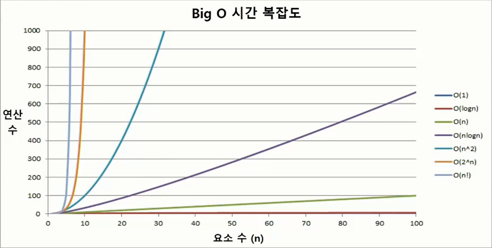

# 1. 알고리즘

> 유한한 단계를 통해 문제를 해결하기 위한 절차나 방법이다.
>
> 주로 컴퓨터용어로 쓰이며 컴퓨터가 어떤 일을 수행하기 위한 단계적 방법을 말한다.
>
> 간단히, 어떠한 문제를 해결하기 위한 방법

#### 알고리즘 표현하는 방법 두 가지

* 슈더코드(Pseudocode)
* 순서도

#### 좋은 알고리즘

* 정확성
* 작업량
* 메모리 사용량
* 단순성
* 최적성

#### 시간 복잡도 (Time Complexity) 

> 실제 걸리는 시간을 측정
>
> 실행되는 명령문의 개수를 계산

#### 빅-오(O) 표기법

> 시간 복잡도 함수 중에서 가장 큰 영향력을 주는 n에 대한 항만을 표시
>
> 계수는 생략하여 표시


# 2. 배열

> 일정한 자료형의 변수들을 하나의 이름으로 열거하여 사용하는 자료구조

```python
A = list(map(int, input().split())) # 1차원 리스트 입력
```

#### 배열 활용 예제

* Gravity



# 3. 버블 정렬 (Bubble Sort)

> 인접한 두 개의 원소를 비교하며 자리를 계속 교환하는 방식

#### 대표적인 정렬 방식 종류

* 버블정렬
* 카운팅 정렬
* 선택 정렬
* 퀵 정렬
* 삽입 정렬
* 병합 정렬

#### 시간 복잡도

* O(n**2)

```python
def BubbleSort(a): # 정렬할 List
    for i in range(len(a)-1, 0, -1): # 범위의 끝 위치
        for j in range(0, i):
            if a[j] > a[j+1]:
                a[j], a[j+1] = a[j+1], a[j] # swap
```

* 최댓값 구하기

# 4. 카운팅 정렬 (Counting Sort)

# 5. 완전검색

# 6. 그리디 (Greedy Algorithm)

