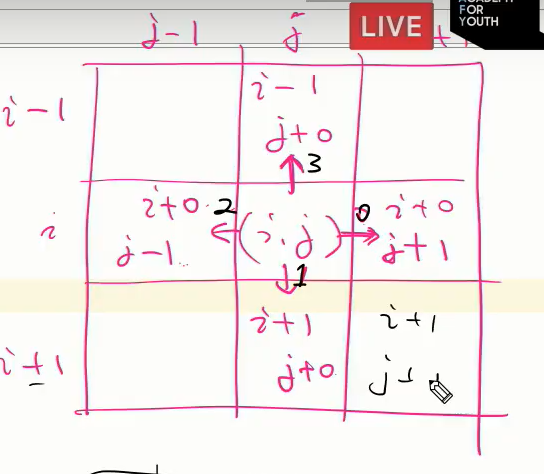

# List 2

# 1. 배열 : 2차 배열

> 1차원 List를 묶어놓은 List
>
> 세로길이(행의 개수), 가로길이(열의 개수)를 필요로 함

```python
N, M = map(int, input().split())

arr = list(map(int, input().split())) for _ in range(N)
#=> [[1, 2, 3], [4, 5, 6]]

arr2 = [[0] * M for _ in range(N)]
#=> [[0, 0, 0], [0, 0, 0]]
```

#### 배열 순회

* n*m개의 모든 원소를 빠짐없이 조사하는 방법
* 행 우선 순회

```python
# i 행의 좌표
# j 열의 좌표
for i in range(len(Array)):
    for j in range(len(Array[i])):
        Array[i][j] # 필요한 연산 수행
```

* 열 우선 순회

```python
for j in range(len(Array[0])):
    for j in range(len(Array)):
        Array[i][j] 
```

* 지그재그 순회

```python
for i in range(len(Array)):
    for j in range(len(Array[0])):
        Array[i][j + (m-1-2*j) * (i%2)]
```

#### 델타를 이용한 2차 배열 탐색

* 2차 배열의 한 좌표에서 4방향의 인접 배열 요소를 탐색하는 방법

```python
MAP = [
    [1,2,3],
    [4,5,6],
    [7,8,9]
]
y = 1
x = 1
print(MAP[1-1][1+0],end = ' ')
print(MAP[1+1][1+0],end = ' ')
print(MAP[1+0][1-1],end = ' ')
print(MAP[1+0][1+1],end = ' ')
print()
dy = [-1,1,0,0]
dx = [0,0,-1,1]

for t in range(4):
    ny = y + dy[t] # 새로운 좌표는 현재 좌표에서 변화량 더해주면 된다
    nx = x + dx[t]
    if ny < 0 or nx <0 or ny >= 3 or nx >= 3 : continue # 범위 바깥에 나가면 continue -> 다음 반복 진행
    print(MAP[ny][nx],end = ' ')
```

```python
# 방법 1
for i in range(N):
    for j in range(M):
        for k in ragne(4):
            ni = i + di[k]
            nj = j + dj[k]
            if 0 <= ni < N and 0 <= nj < M:
                arr[ni][nj]
```

```python
# 방법 2
for i in range(N):
    for j in range(M):
        for di, dj in [[0, 1], [1, 0], [0, -1], [-1, 0]]:
            ni = i + di
            nj = j + dj
            if 0 <= ni < N and 0 <= nj < M:
                arr[ni][nj]
```




#### 전치 행렬

```python
arr = [[1, 2, 3], [4, 5, 6], [7, 8, 9]] # 3*3 행렬

for i in range(3):
    for j in range(3):
        if i < j:
            arr[i][j], arr[j][i] = arr[j][i], arr[i][j]
```

# 2. 부분집합 생성

#### 부분집합의 수

* 집합의 원소가 n개일 때, 공집합을 포함한 부분집합의 수는 2**n개이다.

```
{1, 2, 3, 4}
2 * 2 * 2 * 2 = 16가지 #-> 각 원소가 포함되거나(1) 포함되지 않는(0) 경우의 수(2가지씩)

0 0 0 0 
.
.
1 1 1 1 
```

```python
arr = [1, 2, 3, 4]
bit = [0, 0, 0, 0]
for i in range(2):
    bit[0] = i # 0번쨰 원소
    for j in range(2):
    	bit[1] = j # 1번째 원소
    	for k in range(2):
    		bit[2] = k # 2번째 원소
        	for l in range(2):
    			bit[3] = l # 3 번째 원소
    			
                print(bit) # 생성된 부분집합 출력
                
                for p in range(4):
                    if bit[p]:
                        print(arr[p])
```

#### 비트 연산자

* `&` : 비트 단위로 AND 연산을 한다
* `|` : 비트 단위로 OR 연산을 한다
* `<<` : 피연산자의 비트 열을 왼쪽으로 이동시킨다
* `>>` : 피연산자의 비트 열을 오른쪽으로 이동시킨다

##### << 연산자

* 1<<n : 2**n 즉, 원소가 n개일 경우의 모든 부분집합의 수를 의미

##### & 연산자

* i & (1<<j) : i의 j번째 비트가 1인지 아닌지를 리턴한다

#### 비트연산자를 이용한 부분집합 생성

```python
arr = [3, 6, 7, 1, 5, 4]

n = len(arr) # n : 원소의 개수

for i in range(1<<n): # 1<<n : 부분 집합의 개수
    for j in range(n+1): # 원소의 수만큼 비트를 비교함
        if i & (1<<j): # i의 j번째 비트가 1이면 j번째 원소 출력
            print(arr[j], end=", ")
    print()
print()
```


# 3. 검색 (Search)

> 저장되어 있는 자료 중에서 원하는 항목을 찾는 작업
>
> 목적하는 탐색 키를 가진 항목을 찾는 것
>
> * 탐색 키(search key) : 자료를 구별하여 인식할 수 있는 키

#### 순차 검색

* 가장 간단하고 직관적인 검색방법
* 알고리즘이 단순하여 구현이 쉽지만, 검색 대상의 수가 많은 경우에는 수행시간이 급격히 증가하여 비효율적임

```python
# 정렬되어 있지 않은 경우
def sequentialSearch(a, n, key)
	i = 0
    while i < n and a[i] != key:
        i += 1
    if i < n:
        return i
    else:
        return -1
    
# 정렬되어 있는 경우
def sequentialSearch2(a, n, key)
	i = 0
    while i < n and a[i] < key:
        i += 1
    if i < n and a[i] = key:
        return i
    else:
        return -1
```

#### 이진 검색 (Binary Search) 

* 이진 검색을 하기 위해서는 자료가 **정렬된 상태**여야 한다
* 검색 과정
  1. 자료의 중앙에 있는 원소를 고른다
  2. 중앙 원소의 값과 찾고자 하는 목표 값을 비교한다
  3. 목표 값이 중앙 원소의 값보다 작으면 자료의 왼쪽 반에 대해서 새로 검색을 수행하고, 크다면 오른쪽 반에 대해서 새로 검색 수행한다
  4. 찾고자 하는 값을 찾을 때까지 1~3의 과정을 반복한다

```python
def binarySearch(a, key) # a => 정렬된 배열
	start = 0
    end = len(a) - 1
    while start <= end:
        middle = (start + end) // 2
        if a[middle] == key: # 검색 성공
            return middle
        elif a[middle] > key:
            end = middle - 1 # 오른쪽은 key보다 크므로 버림
        else: # 왼쪽은 key보다 작으므로 버림
            start = middle + 1
    return -1 # 검색 실패
```

* 재귀함수로도 가능하다

# 4. 셀렉션 알고리즘 (Selection Algorithm)

> 저장되어 있는 자료로부터 k번째로 큰 혹은 작은 원소를 찾는 방법

#### 인덱스

> 인덱스라는 용어는 Database에서 유래했으며, 테이블에 대한 동작 속도를 높여주는 자료구조를 일컫는다
>
> Look up table
>
> 인덱스를 저장하는데 필요한 디스크 공간은 보통의 테이블보다 작다
>
> 매번 정렬하면 느려지기때문에 인덱스로 접근한다

#### 선택 과정

1. 정렬 알고리즘을 이용하여 자료 정렬하기
2. 원하는 순서에 있는 원소 가져오기

# 5. 선택 정렬

> 주어진 자료들 중 가장 작은 값의 원소부터 차례대로 선택하여 위치를 교환하는 방식

#### 정렬 과정

1. 주어진 리스트 중에서 최소값을 찾는다
2. 그 값을 리스트의 맨 앞에 위치한 값과 교환한다
3. 맨 처음 위츠를 제외한 나머지 리스트를 대상으로 위의 과정을 반복한다

#### 시간 복잡도

* O(n**2)

#### 거품 정렬과 차이

* 선택 정렬은 구간의 시작이 점점 뒤로간다. 
* 구간이 앞 쪽으로 줄어든다. -> 거품 정렬

```python
def SelectionSort(a):
    for i in range(0, len(a)-1): # 작업 구간의 시작
        min = i # 맨 앞을 제일 작다고 가정
        for j in range(i+1, len(a)):
            if a[min] > a[j]:
                min = j
        a[i], a[min] = a[min], a[i]
```

```python
lst = [3, 2, 9, 5, 8, 6, 1]
N = 7
for j in range(N): # 0 ~ 6 기준
    for i in range(j, N): # 기준 ~ 오른쪽 끝까지
        if lst[j] > lst[i]:
            lst[j], lst[i] = lst[i], lst[j]
    # 기준에 작은 값을 위치시킴
```

