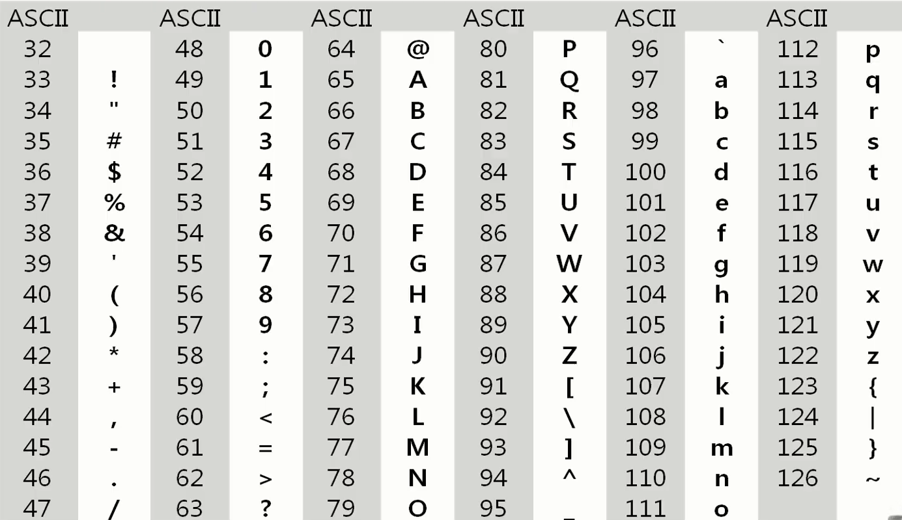
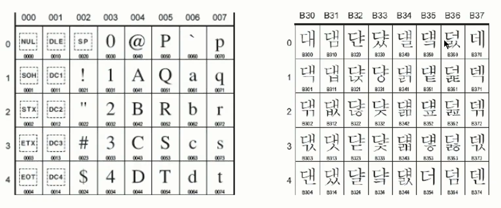
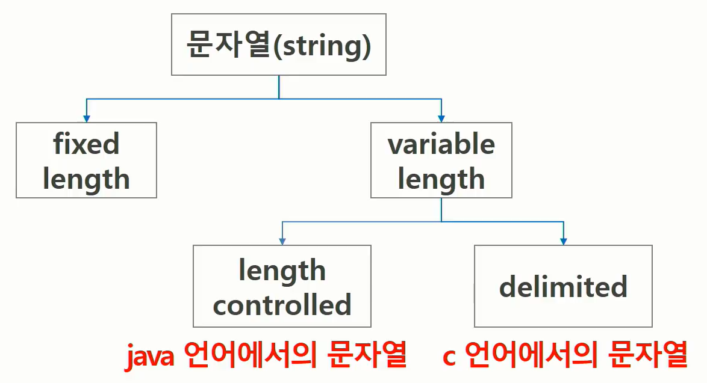

# String

# 1. 문자열

#### 배경 (문자의 표현)

* 문자를 숫자로 표현한다
* 영어 대소문자를 모두 합치면 52, 6(64가지)비트면 모두 표현 가능
* 이를 **코드체계**라고 한다

---

* 네트워크가 발전되기 전 미국의 각 지역 별로 코드체계를 정해놓고 사용했지만,
* 네트워크가 발전하면서 서로간에 정보를 주고 받을 때 정보를 달리 해석한다는 문제 발생
* -> 1967년, 미국에서 **ASCII** (American Standard Code for Information Interchange) 문자 인코딩 표준 제정됨
* **ASCII : 7bit 인코딩으로 128문자를 표현 = 33개의 출력 불가능한 제어 문자들과 공백 + 95개의 출력 가능한 문자들**



* 확장 ASCII : 표준 문자 이외의 악센트 문자, 도형 문자, 특수 문자, 특수 기호 등 부가적인 문자 128개 추가
* 표준 ASCII는 마이크로컴퓨터 하드웨어 및 소프트웨어 사이에서 세계적으로 통용
* But, 확장 ASCII는 프로그램이나 컴퓨터 또는 프린터가 그것을 해독할 수 있도록 설계되어야만 올바로 해독됨

---

* 점차 더 발전해 미국 뿐 아니라 각 나라에서도 자국의 문자를 표현하기 위해 코드체계를 만들어서 사용
* 국가간에 정보를 주고 받을 때 자국의 코드체계를 타 국가가 가지고 있지 않으면 정보 해석 문제 발생 
* -> 다국어 처리를 위한 **유니코드** 표준 마련



* 유니코드도 다시 Character Set 으로 분류된다. 바이트 순서에 대해서 표준화하지 못했음
* 파일 인식 시 이 파일이 UCS-2, UCS-4인지 인식하고 각 경우를 구분해서 다르게 구현해야하는 문제 발생
* -> **유니코드 인코딩** (UTF : Unicode Transformation Format)
  * UTF-8 (in web) = MIN : 8bit, MAX : 32bit(1 Byte * 4)
  * UTF-16 (in window, java) = MIN : 16bit, MAX : 32bit(2 Byte * 2) 
  * UTF-32 (in unix) = MIN : 32bit, MAX : 32bit(4 Byte * 1)

#### Python 인코딩

* 2.x 버전 - ASCII -> #-\*- coding: utf-8 -\*- (첫줄에 명시)
* 3.x 버전 - 유니코드  UTF-8 -> 생략 가능

#### 문자열의 분류



#### Python에서의 문자열 처리

* char 타입 없음
* 텍스트 데이터의 취급 방법이 통일되어 있음
* 시퀀스 자료형으로 분류되어 인덱싱, 슬라이싱 사용 가능
* immutable

# 2. 패턴 매칭

#### 패턴 매칭에 사용되는 알고리즘들

* 고지식한 패턴 검색 알고리즘
* 카프-라빈 알고리즘
* KMP 알고리즘
* 보이어-무어 알고리즘

#### 고지식한 알고리즘 (Brute Force)

> 문자열을 처음부터 끝까지 차례대로 순회하면서 패턴 내의 문자들을 일일이 비교하는 방식

```python
p = 'is' # 찾을 패턴
t = 'This is a book~!' # 전체 텍스트
M = len(p)
N = len(t)

def BruteForce(p, t):
    i = 0 # t의 인덱스
    j = 0 # p의 인덱스
    while j < M and i < N:
        if t[i] != p[j]:
            i = i - j
            j = -1
        i = i + 1
        j = j + 1
    if j == M : return i - M # 검색 성공
    else : return -1 # 검색 실패
```

```python
for start_idx in range(len(lst)-len(pattern)+1):
    for p_idx in range(len(pattern)):
        if lst[start_idx+p_idx] != pattern[p_idx]:
            break
    else:
        cnt += 1
```


#### 시간 복잡도

* O(NN)

#### KMP 알고리즘

> 불일치가 발생한 텍스트 스트링의 앞 부분에 어떤 문자가 있을 지를 미리 알고 있으므로, 불일치가 발생한 앞 부분에 대하여 다시 비교하지 않고 매칭을 수행
>
> 패턴을 전처리하여 배열 next[M]을 구해서 잘못된 시작을 최소화함
>
> * next[M] : 불일치가 발생했을 경우 이동할 다음 위치

#### 시간 복잡도

* O(M+N) 

#### 보이어-무어 알고리즘

> 오른쪽에서 왼쪽으로 비교
>
> 대부분의 상용 소프트웨어에서 채택하고 있는 알고리즘
>
> 패턴의 오른쪽 끝에 있는 문자가 불일치하고 이 문자가 패턴 내에 존재하지 않는 경우, 이동 거리는 무려 패턴의 길이 만큼이 된다

#### 문자열 매칭 알고리즘 비교

* 찾고자 하는 문자열 패턴의 길이 : m

* 총 문자열 길이 : n

* 카프-라빈 알고리즘 : 수행시간 O(n)

* KMP 알고리즘 : 수행시간 O(n)

# 3. 문자열 암호화

#### bit열의 암호화

* 배타적 논리합 연산(XOR) 사용

# 4. 문자열 압축

* Run-length encoding 알고리즘
* 허프만 코딩 알고리즘