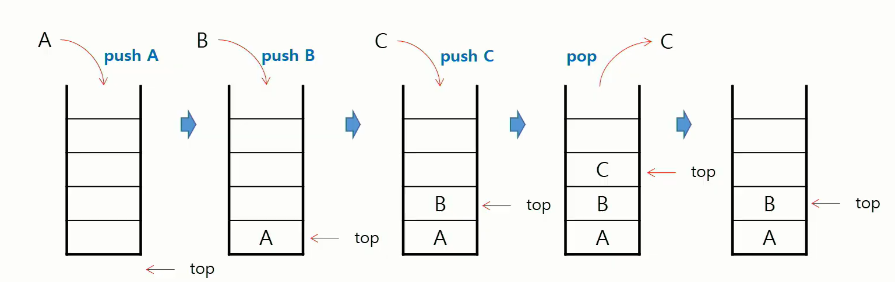
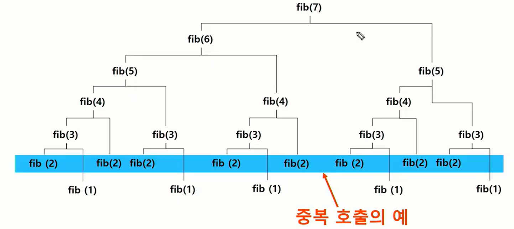

# 스택1

# 스택

> 스택(Stack)의 특성
>
> * 물건을 쌓아 올리듯 자료를 쌓아 올린 형태의 자료구조
> * 스택에 저장된 자료는 선형 구조를 갖는다
> * 선형구조 : 자료 간의 관계가 1대1의 관계를 갖는다
> * 비선형구조 : 자료 간의 관계가 1대N의 관계를 갖는다 (예 : 트리)
> * 스택에 자료를 삽입하거나 스택에서 자료를 꺼낼 수 있다
> * 마지막에 삽입한 자료를 가장 먼저 꺼낸다 = 후입선출(LIFO, Last-In-First-Out)

#### 프로그램에서 구현하기 위해서 필요한 자료구조와 연산

* 자료구조 : 자료를 선형으로 저장할 저장소
  * 저장소 자체를 스택이라 부르기도 한다
  * 마지막 삽입된 원소의 위치 : `top`
* 연산
  * 삽입 : 저장소에 자료를 저장. `push`
  * 삭제 : 저장소에서 자료를 꺼낸다. `pop` 역순으로 꺼냄
  * `isEmpty` = 스택이 공백인 지 아닌지 확인하는 연산
  * `peek` = 스택의 top에 있는 item(원소)를 확인하는 연산

#### 삽입/삭제 과정



#### `push` 알고리즘

```python
def push(item):
    s.append(item)
```

#### `pop` 알고리즘

```python
def pop():
    if len(s) == 0:
        # underflow
        return 
    else:
        return s.pop(-1)
```

#### 고려사항

1차원 배열로 구현할 경우 구현이 용이하지만 스택의 크기를 변경하기 어려움

-> 저장소를 동적으로 할당하여 스택을 구현하는 방법이 있다

-> 동적 연결리스트를 이용하여 구현

-> 구현이 복잡 but 메모리를 효율적으로 사용 가능

# 재귀호출

> 자기 자신을 호출하여 순환 수행되는 것
>
> 함수에서 실행해야 하는 작업의 특성에 따라 일반적인 호출방식보다 재귀호출방식을 사용하여 함수를 만들면 프로그램의 크기를 줄이고 간단하게 작성 

#### 배열 출력

```python
def f(i, k):
    if i == k:
        return 
    else:
        print(A[i])
        f(i+1, k) # 다음 원소로 이동
        
N = 3
A = [1, 2, 3]
f(0, N) # 배열을 출력하는 함수
```

#### 피보나치 수열

```python
def fibo(n):
    if n < 2:
        return n
    else:
        return fibo(n-1) + fibo(n-2)
```

-> 중복호출이 많은 문제점. Call Tree를 보자



# Memoization

> 메모이제이션은 컴퓨터 프로그램을 실행할 때 이전에 계산한 값을 메모리에 저장해서 매번 다시 계산하지 않도록 함
>
> 전체적인 실행속도를 빠르게 하는 기술
>
> 동적 계획법의 핵심이 되는 기술
>
> 'memoization' = to put in memory (메모리에 넣기)

```python
# memo를 위한 배열을 할당하고, 모두 0으로 초기화 한다
# memo[0]을 0으로 memo[1]는 1로 초기화 한다

def fibo(n):
    global memo
    if n >= 2 and memo[n] == 0:	# 아직 계산되지 않은 값이면
        memo[n] = (fibo(n-1) + fibo(n-2))
    return memo[n]	# 있으면 그걸로

memo = [0] * (n+1)
memo[0] = 0
memo[1] = 1
```

# DP (Dynamic Programming)

> 동적 계획 알고리즘
>
> 그리디 알고리즘 같이 **최적화 문제**를 해결하는 알고리즘
>
> 입력 크기가 작은 문제부터 해결 

```python
def fibo(n):
    for i in range(2, n+1):
        table[i] = table[i-1] + table[i-2]
   
    return table[n]

table = [0] * (n+1)
table[0] = 0
table[1] = 1
```

memorization을 재귀적 구조에 사용하는 것보다 반복적 구조로 DP를 구현한 것이 성능 면에서 보다 효율적

# DFS (깊이우선탐색)

> 비선형구조인 그래프 구조는 빠짐없이 검색하는 것이 중요
>
> 두 가지 방법
>
> * 깊이 우선 탐색 (Depth First Search, DFS)
> * 너비 우선 탐색 (Breadth First Search, BFS)

#### 전체적인 순회이해

1. 시작 정점의 한 방향으로 갈 수 있는 경로가 있는 곳까지 깊이 탐색
2. 더 이상 갈 곳이 없게되면, **가장 마지막에 만났던 갈림길**간선이 있는 정점으로 되돌아옴 => 후입선출구조의 스택 사용
3. 다른 방향의 정점으로 계속 반복하여 결국 모든 정점을 방문

#### DFS 알고리즘

1. 시작 정점 v를 결정하여 방문
2. 정점 v에 인접한 정점 중에서
   1. 방문하지 않은 정점 w가 있으면, 정점 v를 스택에 push하고 정점 w를 방문한다. 그리고 w를 v로 하여 다시 2)를 반복한다
   2. 방문하지 않은 정점이 없으면, 탐색의 방향을 바꾸기 위해서 스택을 pop하여 받은 가장 마지막 방문 정점을 v로 하여 다시 2)를 반복한다
3. 스택이 공백이 될 때까지 2)를 반복