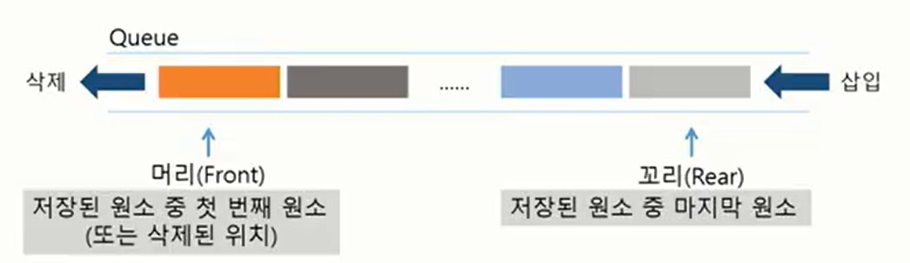
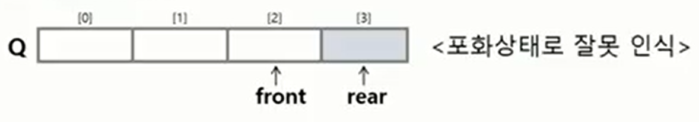
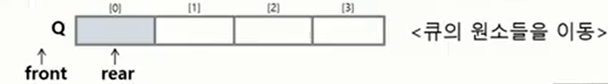
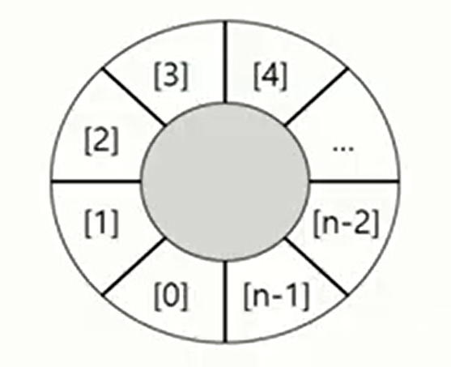

# 큐(Queue)

> 스택과 마찬가지로 삽입과 삭제의 위치가 제한적인 자료구조
>
> 선입선출구조 (FIFO : First In First Out)
>
> -> 가장 먼저 삽입된 원소가 가장 먼저 삭제



#### 주요 연산

| 연산            | 기능                                                |
| --------------- | --------------------------------------------------- |
| `enQueue(item)` | 큐의 뒤쪽(rear 다음)에 원소를 삽입하는 연산         |
| `deQueue()`     | 큐의 앞쪽(front)에서 원소를 삭제하고 반환하는 연산  |
| `createQueue()` | 공백 상태의 큐를 생성하는 연산                      |
| `isEmpty()`     | 큐가 공백상태인지를 확인하는 연산                   |
| `isFull()`      | 큐가 포화상태인지를 확인하는 연산                   |
| `Qpeek()`       | 큐의 앞쪽(front)에서 원소를 삭제 없이 반환하는 연산 |


# 선형큐

> 1차원 배열을 이용한 큐

#### 상태 표현

- 초기 상태 : front = rear = -1 
- 공백 상태 : front = rear
- 포화 상태 : rear = n-1 (n : 배열의 크기, n-1 : 배열의 마지막 인덱스)

#### 문제점



#### 해결방법 1

매 연산이 이루어질 때마다 저장된 원소들을 배열의 앞부분으로 모두 이동시킴

원소 이동에 많은 시간이 소요되어 큐의 효율성이 급격히 떨어짐



# 원형큐

#### 해결방법 2

1차원 배열을 사용하되, 논리적으로는 배열의 처음과 끝이 연결되어 원형형태의 큐를 이룬다고 가정하고 사용

* 원형 큐의 논리적 구조



#### 초기 공백 상태

front = rear = 0

#### Index의 순환

front, rear의 위치가 배열의 마지막인 n-1을 가르킬 때, 0으로 이동함

#### front 변수

공백 상태와 포화 상태 구분을 쉽게 하기 위해 항상 빈자리로 둠

#### 삽입 위치 및 삭제 위치

|        | 삽입 위치               | 삭제 위치                 |
| ------ | ----------------------- | ------------------------- |
| 선형큐 | rear = rear + 1         | front = front + 1         |
| 원형큐 | rear = (rear + 1) mod n | front = (front + 1) mod n |

* 공백상태 : front = rear
* 포화상태 : (rear + 1) mod n = front 

# 연결큐

> 단순 연결 리스트(Linked List)를 이용한 큐 

# 우선순위 큐

> 우선순위를 가진 항목들을 저장하는 큐
>
> FIFO 순서가 아니라 우선순위가 높은 순서대로 먼저 나가게 된다

# 큐의 활용 : 버퍼(Buffer)

> 데이터를 한 곳에서 다른 한 곳으로 전송하는 동안 일시적으로 그 데이터를 보관하는 메모리의 영역
>
> 버퍼링 : 버퍼를 활용하는 방식 또는 버퍼를 채우는 동작
>
> 순서대로 입력/출력/전달되어야하므로 큐를 활용함


# BFS(Breadth First Search)

> 너비 우선 탐색 

```python
def BFS(G, v):	# 그래프 G, 탐색 시작점 v
    visited = [0] * (n+1)	# n : 정점의 개수
    queue = []		# 큐 생성
    queue.append(v)	# 시작점 v를 큐에 삽입
    
    while queue:			# 큐가 비어있지 않은 경우
        t = queue.pop(0)	# 큐의 첫번째 원소 반환
        if not visited[t]:	# 방문되지 않은 곳이라면
            visited[t] = True	# 방문한 것으로 표시 
            visit(t)		# 정점 t에서 할 일
        	for i in G[t]:	# t와 연결된 모든 정점에 대해
            	if not visited[i]:	# 방문되지 않은 곳이라면
                	queue.append(i)	# 큐에 넣기
```

```python
def BFS(G, v, n):	# 그래프 G, 탐색 시작점v
    visited = [0] * (n+1)	# n : 정점의 개수
    queue = []		# 큐 생성
    queue.append(v)	# 시작점 v를 큐에 삽입
    visited[v] = 1
    
    while queue:			# 큐가 비어있지 않은 경우
        t = queue.pop(0)	# 큐의 첫번째 원소 반환
        visit(t)
        for i in G[t]:		# t와 연결된 모든 정점에 대해
            	if not visited[i]:	# 방문되지 않은 곳이라면
                    queue.append(i)	# 큐에 넣기
        			visited[i] = visited[t] + 1	# n으로 부터 1만큼 이동
```

