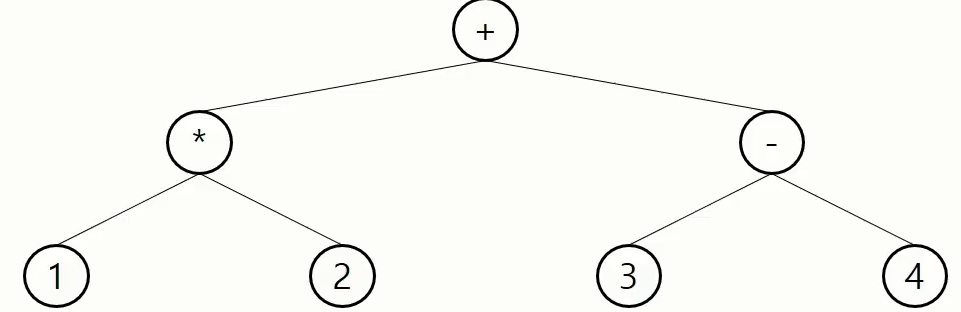

# 트리

> 비선형 구조
>
> 원소들 간에 1:n 관계를 가지는 자료구조
>
> 원소들 간에 계층관계를 가지는 계층형 자료구조
>
> 상위 원소에서 하위 원소로 내려가면서 확장되는 트리(나무)모양의 구조

# 용어 정리


* 한 개 이상의 노드로 이루어진 유한 집합

| 용어                     | 뜻                                                           |
| ------------------------ | ------------------------------------------------------------ |
| 노드 `node`              | 트리의 원소                                                  |
| 간선 `edge`              | 노드를 연결하는 선. 부모 노드와 자식노드를 연결              |
| 루트 노드 `root node`    | 트리의 시작 노드 (A)                                         |
| 형제 노드 `sibling node` | 같은 부모 노드의 자식 노드들 (B, C, D 형제)                  |
| 조상 노드                | 간선을 따라 루트 노드까지 이르는 경로에 있는 모든 노드들 (K의 조상 노드 : F, B, A) |
| 서브 노드 `subtree`      | 부모 노드와 연결된 간선을 끊었을 때 생성되는 트리            |
| 자손 노드                | 서브 트리에 있는 하위 레벨의 노드들 (B의 자손 노드 : E, F, K) |

### 차수 `degree`

* 노드의 차수 = 노드에 연결된 자식 노드의 수 (B의 차수 = 2)

* 트리의 차수 = 트리에 있는 노드의 차수 중에서 가장 큰 값 (트리 T의 차수 = 3)

* 단말노드 (리프 노드) = 차수가 0인 노드. 자식 노드가 없는 노드

### 높이

* 노드의 높이 = 루트에서 노드에 이르는 간선의 수. 노드의 레벨
* 트리의 높이 = 트리에 있는 노드의 높이 중에서 가장 큰 값. 최대 레벨
* 시작이 0일 수 있고, 1일 수 있다 (상대적)


# 이진 트리

> 모든 노드들이 2개의 서브트리를 갖는 특별한 형태의 트리
>
> 각 노드가 자식 노드를 최대한 2개 까지만 가질 수 있는 트리
>
> * 왼쪽 자식 노드 (left child node)
> * 오른쪽 자식 노드 (right child node)


### 특성

* 레벨 i에서의 노드의 최대 개수는 2^i개. 2^(level-1)
* 높이가 h인 이진 트리가 가질 수 있는 노드의 최소 개수는 (h + 1)개가 되며, 최대 개수는 (2^(h+1) - 1)개가 된다

### 포화 이진 트리 (Full Binary Tree)

> 모든 레벨에 노드가 포화상태로 차 있는 이진 트리
>
> 높이가 h일 때, 최대의 노드 개수인 (2^(h+1) - 1)의 노드를 가진 이진 트리
>
> -> 높이 3일때 2^(3+1) - 1 = 15개의 노드
>
> **루트를 1번**으로 하여 정해진 위치에 대한 노드 번호를 가짐


### 완전 이진 트리 (Complete Binary Tree)

> 포화 이진 트리의 노드 번호 1번부터 n번까지 빈 자리가 없는 이진 트리


### 편향 이진 트리 (Skewed Binary Tree)

> 높이 h에 대한 최소 개수의 노드를 가지면서 한쪽 방향의 자식 노드만을 가진 이진 트리
>
> * 왼쪽 편향 이진 트리
> * 오른쪽 편향 이진 트리


### 순회 (Traversal)

* 트리의 각 노드를 중복되지 않게 전부 방문(visit) 하는 것
* 트리의 노드들을 체계적으로 방문하는 것


* 전위순회 (preorder traversal) : VLR
  - 부모노드 방문 후, 자식노드를 좌, 우 순으로 방문

* 중위순회 (inorder traversal) : LVR
  * 왼쪽 자식노드, 부모노드, 오른쪽 자식노드 순으로 방문
* 후회순회 (postorder traversal) : LRV
  * 자식노드를 좌우 순서로 방문한 후, 부모노드로 방문 

### 배열을 이용한 이진 트리의 표현

* 노드 번호가 i 인 노드의 부모 노드 번호? `i//2`

* 노드 번호가 i 인 노드의 왼쪽 자식 노드 번호? `2*i`
* 노드 번호가 i 인 노드의 오른쪽 자식 노드 번호? `2*i+1`
* 편향 이진 트리의 경우에는 메모리 공간 낭비 발생 -> 연결 리스트로 보완 가능

```python
def dfs(now) :
    if now == 0 :
        return
    preorder.append(now)
    dfs(left[now]) # left
    inorder.append(now)
    dfs(right[now]) # right
    postorder.append(now)
    return
```

```python
def dfs(now):
    if now > 31 or tree[now] == 0: return
    preorder.append(tree[now])
    dfs(now * 2) # left
    inorder.append(tree[now])
    dfs(now*2 + 1) # right
    postorder.append(tree[now])
    return

tree = [0 for _ in range(32)]
tree[1] = 1
tree[2] = 3
tree[3] = 5
tree[4] = 2
tree[5] = 6
tree[6] = 7
tree[7] = 8
tree[12] = 9
tree[15] = 4
tree[24] = 10

preorder = []
inorder = []
postorder = []
dfs(1)
print(*preorder)
print(*inorder)
print(*postorder)
```

### 수식 트리

> 수식을 표현하는 이진 트리
>
> 수식 이진 트리 (Expression Binary Tree)
>
> 연산자는 루트 노드 이거나 가지노드
>
> 피연산자는 모두 잎 노드



* 중위 순회  `A / B * C * D + E`
* 후휘 순회  `A B / C * D * E +`
* 전위 순회  `+ * * / A B C D E`


# 이진탐색 트리

> 탐색작업을 효율적으로 하기 위한 자료구조
>
> 모든 원소는 서로 다른 유일한 키를 갖는다
>
> key(왼쪽 서브트리) < key(루트 노드) < key(오른쪽 서브트리)
>
> 중위 순회하면 오름차순으로 정렬된 값  


### 탐색 연산

* 루트에서 시작
* 탐색할 키 값 x를 루트 노드의 키 값과 비교
* 서브트리에 대해서 순환적으로 탐색 연산을 반복

### 성능

* 탐색, 삽입, 삭제 시간은 트리의 높이만큼 시간이 걸린다
* 평균의 경우 : O(log n)
* 최악의 경우 : O(n)

### 검색 알고리즘의 비교

* 배열에서의 순차 검색 : O(N)
* 정렬된 배열에서의 순차 검색 : O(N)
* 정렬된 배열에서의 이진 탐색 : O(log N)
* 이진 탐색트리에서의 평균 : O(log N)
  * 완전 이진 트리 또는 균형 트리로 바꾸면 최악의 경우를 없앨 수 있다 
* 해쉬 검색 : O(1)

# 힙(heap)

> 완전 이진 트리에 있는 노드 중에서 키값이 가장 큰 노드나 키값이 가장 작은 노드를 찾기 우해서 만든 자료구조

### 최대 힙

* 키값이 가장 큰 노드를 찾기 위한 완전 이진 트리
* {부모노드의 키값 > 자식노드의 키값}
* 루트 노드 : 키값이 가장 큰 노드

### 최소 힙

* 키값이 가장 작은 노드를 찾기 위한 완전 이진 트리
* {부모노드의 키값 < 자식노드의 키값}
* 루트 노드 : 키값이 가장 작은  노드


