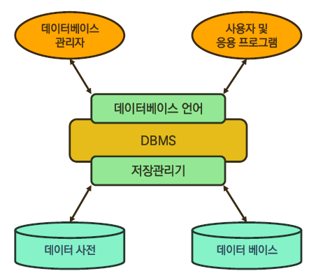
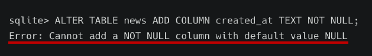

# 01. SQL

> 210914

# DB

- 체계화된 데이터의 모임
- 자료를 구조화해서 기억시켜놓은 테이블의 집합체



#### 장점

* 데이터 중복 최소화
* 데이터 무결성
* 데이터 일관성
* 데이터 독립성
* 데이터 표준화
* 데이터 보안 유지

#  RDB

> **R**elational **D**atabase

* 관계형 데이터 베이스
* 키(key)와 값(value)들의 간단한 관계(relation)를 표(table) 형태로 정리한 데이터 베이스
* 관계형 모델에 기반

#### 용어 정리

| 용어   | 뜻                                                           |
| ------ | ------------------------------------------------------------ |
| 스키마 | 데이터베이스에서 자료의 구조, 표현방법, 관계 등 전반적인 명세를 기술한 것 |
| 테이블 | 행과 열의 모들을 사용해서 조직된 데이터 요소들의 집합        |
| 열     | 고유한 데이터 형식 지정                                      |
| 행     | 실제 데이터가 저장되는 형태                                  |
| 기본키 | 각 행(레코드)의 고유 값 **Primary Key**                      |

# RDBMS

> **R**elational **D**atabase **M**anagement **S**ystem

#### SQLite

* 비교적 가벼운 데이터베이스
* 안드로이드에 기본적으로 탑제

* 이 외에도 MySQL, PostgreSQL, ORACLE, MS SQL,...

# SQL

> **S**tructured **Q**uery **L**anguage

* 관계형 데이터베이스 관리시스템의 **데이터 관리**를 위해 설계된 **특수 목적으로 프로그래밍 언어**
* 데이터베이스 스키마 생성 및 수정
* 자료의 검색 및 관리
* 데이터베이스 객체 접근 조정 관리

|                      분류                      |                             개념                             |             예시             |
| :--------------------------------------------: | :----------------------------------------------------------: | :--------------------------: |
|             DDL - 데이터 정의 언어             | 관계형 데이터베이스 구조(테이블, 스키마)를 정의하기 위한 명령어 |      CREATE DROP ALTER       |
|             DML - 데이터 조작 언어             |    데이터를 저장, 조회, 수정, 삭제 등을 하기 위한 명령어     | INSERT SELECT UPDATE DELETE  |
| DCL - 데이터 제어 언어 (Data Control Language) |    데이터베이스 사용자의 권한 제어를 위해 사용하는 명령어    | GRANT REVOKE COMMIT ROLLBACK |

- `;` 까지를 하나의 문장으로 판단
- 소문자로 작성해도 동작은 된다 (but, style guide)
  * 명령어 - 대문자
  * 테이블명 or 컬럼명 - 소문자
- 주석은 한줄(`--`), 여러줄 (`/* 주석을 입력 */`)

---

## DDL

> **D**ata **D**efinition **L**anguage

#### CREATE

```sql
CREATE TABLE 테이블명 (
	컬럼명1 데이터타입 [제약조건],
    컬명명2 데이터타입 NOT NULL,
    ...
);
```

#### ALTER

```sql
ALTER TABLE 기존테이블명 RENAME TO 새로운테이블명;
```

```sql
ALTER TABLE 테이블명 ADD COLUMN 컬럼명 데이터타입설정;
```



##### 해결 방법 2가지

* NOT NULL 설정 없이 추가하기
* 기본 값(DEFAULT) 설정하기


#### DROP

```sql
DROP TABLE 테이블명;
```

* 데이터 타입

> https://www.sqlite.org/datatype3.html

| Data Type               |                                    |
| ----------------------- | ---------------------------------- |
| INT or INTEGER          | 정수                               |
| CHAR(n) or CHARACTER(n) | 고정 길이 n을 가지는 문자열        |
| VARCHAR(n)              | 최대 길이가 n인 가변 길이의 문자열 |
| FLOAT(n)                | 부동 소수점 실수                   |
| DATE                    | 년, 월, 일로 표현되는 날짜         |
| TIME                    | 시, 분, 초로 표현되는 시간         |
| BLOB                    | 바이너리 값 그대로 저장            |
| TEXT                    | 문자열                             |

## DML

> **D**ata **M**anipulation **L**anguage

#### INSERT

```sql
INSERT INTO 테이블명 (컬럼1, 컬럼2, ...) VALUES (값1, 값2, ...);
```

* 모든 컬럼을 불러올 때는 컬럼리스트 생략 가능
* SQLite는 따로 PRIMARY KEY  속성을 정의하지 않으면 자동으로 PK 옵션을 가진 `rowid`를 정의

#### SELECT

```sql
SELECT 컬럼1, 컬럼2, ... FROM 테이블명;
```

* LIMIT - 쿼리에서 반환되는 행 수를 제한
  * `OFFSET 3 LIMIT 3` ->  (3까지 제끼고) 456

* WHERE - 조건 검색

  ```sql
  SELECT 컬럼1, 컬럼2, ... FROM 테이블명 WHERE 조건;
  ```

* DISTINCT - 중복 행을 제거

  ```sql
  SELECT DISTINCT 컬럼 FROM 테이블명;
  ```

#### UPDATE

```sql
UPDATE 테이블명
SET 컬럼명=수정값 [, 컬럼명2=수정값2]
[WHERE 조건];
```

* 중복 불가능한(UNIQUE) 값인 `rowid`를 기준으로 수정하자

#### DELETE

```sql
DELETE FROM 테이블명
[WHERE 조건];
```

* 다시 INSERT했을 시, ID를 재사용하는 것이 기본 값
* CREATE할 떄 AUTOINCREMENT를 설정하면 재사용 방지

---

##### Sqlite Aggregate Functions

* COUNT

  ```sql
  SELECT COUNT(컬럼) FROM 테이블명;
  ```

* AVG, SUM, MIN, MAX

  ```sql
  SELECT AVG(컬럼) FROM 테이블명;
  SELECT SUM(컬럼) FROM 테이블명;
  SELECT MIN(컬럼) FROM 테이블명;
  SELECT MAX(컬럼) FROM 테이블명;
  ```

---

* LIKE

  ```sql
  SELECT * FROM 테이블 WHERE 컬럼 LIKE '와일드카드패턴';
  ```

  * `%` : 이 자리에 문자열이 있을 수도, 없을 수도 있다
  * `_` : 이 자리에 반드시 한 개의 문자가 존재해야 한다.

* ORDER BY

  ```sql
  SELECT * FROM 테이블 ORDER BY 컬럼[ ASC];
  SELECT * FROM 테이블 ORDER BY 컬럼1, 컬럼2 DESC; 
  ```

  * ASC : 오름차순 (default)
  * DESC : 내림차순

* GROUP BY

  ```sql
  SELECT 컬럼1, aggregate_function(컬럼2) FROM 테이블 GROUP BY 컬럼1, 컬럼2;
  ```

  * 중복 값 제거  -> 요약 행 집합으로 만듦
  * `AS` 를 활용하여 컬럼 명을 바꿔서 조회할 수 있음


