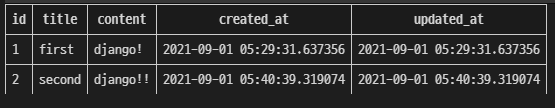

# 01. Model

> :pushpin: 2021.09.01

### Model의 개념

> "웹 애플리케이션의 데이터를 **구조화**하고 **조작**하기 위한 도구"

* 단일한 데이터에 대한 정보를 가짐
* 저장된 데이터베이스의 구조
* Django는 model을 통해 데이터에 접속하고 관리
* 일반적으로 각각의 model은 하나의 데이터베이스 테이블에 매핑됨
* model != 데이터베이스


### Database

* 데이터베이스(DB)
  * 체계화된 데이터의 모임
* 쿼리(Query)
  * 데이터를 조회하기 위한 명령어
  * 조건에 맞는 데이터를 추출하거나 조작하는 명령어
  * "Query를 날린다." -> DB를 조작한다.

### Database의 기본 구조

* 스키마(Schema)
  * 데이터베이스에서 자료의 구조, 표현방법, 관계 등을 정의한 구조, 뼈대 (structure)
* 테이블(Table)
  * 컬럼(column) : 필드(field) or 속성
  * 행(row) : 레코드(record) or 튜플
* PK(기본키)
  * 각 행(record)의 고유값으로 Primary Key로 불린다
  * 반드시 설정 
  * 데이터베이스 관리 및 관계 설정시 주요하게 활용된다


---

# ORM

> **O**bject - **R**elational - **M**apping

* Django (OOP 프로그래밍) - SQL (데이터베이스) -> 호환되지 않는 데이터를 변환하는 프로그래밍 기법
* Django는 내장 Django ORM을 사용함


### 장/단점

- 장점
  - SQL을 몰라도 DB 조작이 가능. (SQL 문법을 몰라도 쿼리 조작 가능)
  - SQL의 절차적인 접근이 아닌 객체 지향적인 접근으로 인한 높은 생산성

- 단점
  - ORM 만으로 완전한 서비스를 구현하기 어렵다.

> But, Why?

* 현대 웹 프레임워크의 요점은 웹 개발의 속도를 높이는 것. **생산성**

- 객체 지향 프로그래밍에서 DB를 편리하게 관리하게 위해 ORM 프레임워크를 도입
- **"우리는 DB를 객체(object)로 조작하기 위해 ORM을 사용한다."**

---

**프로젝트 시작**

> 01_django_model 폴더 안에서 진행

```python
$ django-admin startproject crud 
$ cd crud
$ python manage.py startapp articles
# crud/settings.py

INSTALLED_APPS = [
    'articles',	
		...
]
```

#### models.py 정의

```python
# articles/models.py

class Article(models.Model): # 상속
    # id는 기본적으로 처음 테이블 생성시 자동으로 만들어진다.
    title = models.CharField(max_length=10) # 클래스 변수(DB의 필드)
    content = models.TextField() 
```

#### DataField's options

> https://docs.djangoproject.com/en/3.2/ref/models/fields/

- `CharField(max_length=None, **options)`
  - 길이의 제한이 있는 문자열을 넣을 때 사용
  - CharField의 max_length는 필수 인자
  - **필드의 최대 길이(문자),** 데이터베이스 레벨과 Django의 유효성 검사(값을 검증하는 것)에서 활용
- `TextField(**options)`
  - **글의 수가 많을 때 사용**
  - max_length 옵션을 주면 자동양식필드의 textarea 위젯에 반영은 되지만 모델과 데이터베이스 수준에는 적용되지 않음
    * max_length는 CharField에서 사용해야함

---

# Migrations

> "django가 model에 생긴 변화를 반영하는 방법"

### `makemigrations`

> 설계도 만들기

- 모델을 변경한 것에 기반한 새로운 마이그레이션(like 설계도)을 만들 때 사용
- 모델을 활성화 하기 전에 DB 설계도(마이그레이션) 작성

```python
$ python manage.py makemigrations # manage.py 클래스를 기반으로 설계도 만들기
```

- `0001_initial.py` 생성 확인

```python
# 설계도
# ORM에 의해서 SQL로 해석될 것
class Migration(migrations.Migration):

    initial = True

    dependencies = [
    ]

    operations = [
        migrations.CreateModel(
            name='Article',
            fields=[
                ('id', models.BigAutoField(auto_created=True, primary_key=True, serialize=False, verbose_name='ID')),
                ('title', models.CharField(max_length=10)),
                ('content', models.TextField()),
            ],
        ),
    ]
```

### `migrate`

> 설계도를 실제 DB에 반영하는 과정

* 마이그레이션을 DB에 반영하기 위해 사용

- `migrate` 는 `makemigrations` 로 만든 설계도를 실제 `db.sqlite3` DB에 반영한다.

- 모델에서의 변경 사항들과 DB의 스키마가 동기화를 이룬다.

  ```
  $ python manage.py migrate
  ```


#### `sqlmigrate`

- 해당 migrations 설계도가 SQL 문으로 어떻게 해석되어서 동작할지 미리 확인 할 수 있다.

  ```
  $ python manage.py sqlmigrate app_name 0001
  ```


#### `showmigrations`

- migrations 설계도들이 migrate 됐는지 안됐는지 여부를 확인 할 수 있다.

  ```
  $ python manage.py showmigrations
  ```


### Model 중요 3단계

##### 1. `models.py` 

* 변경사항 발생 (생성 / 수정)

##### 2. `$ python manage.py makemigrations` 

* migration 파일 만들기 (설계도)

##### 3. `$ python manage.py migrate` 

* DB에 반영 (모델과 DB의 동기화)


#### models.py 수정

```python
# articles/models.py
class Article(models.Model):
    title = models.CharField(max_length=10)
    content = models.TextField()
    created_at = models.DateTimeField(auto_now_add=True)
    updated_at = models.DateTimeField(auto_now=True)
```


```python
# articles\migrations\0002_auto_20210901_1138.py
class Migration(migrations.Migration):

    dependencies = [
        ('articles', '0001_initial'),
    ]

    operations = [
        migrations.AddField(
            model_name='article',
            name='created_at',
            field=models.DateTimeField(auto_now_add=True, default=django.utils.timezone.now),
            preserve_default=False,
        ),
        migrations.AddField(
            model_name='article',
            name='updated_at',
            field=models.DateTimeField(auto_now=True),
        ),
    ]
```

#### DataField's options

* `DateTimeField(auto_now=False, auto_now_add=False, **options)`
  - 최초 생성 일자
    - `auto_now_add=True`
    - django ORM이 최초 insert(테이블에 데이터 입력)시에만 현재 날짜와 시간으로 갱신
  - 최종 수정 일자
    - `auto_now=True`
    - django ORM이 save를 할 때마다 현재 날짜와 시간으로 갱신

---

# Database API

> https://docs.djangoproject.com/en/3.2/ref/models/querysets/
>
> DB를 조작하기 위한 도구
>
> = database - abstract API = database - access API

* Django가 기본적으로 ORM을 제공함에 따른 것으로 DB를 편하게 조작할 수 있도록 도움
* Model을 만들면 django는 객체들을 만들고 읽고 수정하고 지울 수 있는 database-abstract API를 자동으로 만듦

### DB API 구문

#### Making Queries


* ##### `objects` Manager

  * django 모델에 데이터베이스 query 작업이 제공되는 인터페이스
  * 기본적으로 모든 django 모델 클래스에 object라는 Manager를 추가

* ##### QuerySet

  * 데이터베이스로부터 전달받은 객체 목록
  * queryset 안의 객체는 0개, 1개 혹은 여러 개
  * 데이터베이스로부터 조회, 필터, 정렬 등 수행 

#### Django shell

> https://django-extensions.readthedocs.io/en/latest/

- 일반 파이썬 쉘을 통해서는 장고 프로젝트 환경에 접근할 수 없음
- 그래서 장고 프로젝트 설정이 로딩된 파이썬 쉘을 활용해 DB API 구문 테스트 진행
- 기본 Django shell 보다 더 많은 기능을 제공하는 shell_plus를 사용해서 진행

```python
$ pip install django-extensions
```

```python
# settings.py

INSTALLED_APPS = [
    ...
    'django_extensions',
    ...
]
```

```python
$ python manage.py shell_plus
```


---

# CRUD

> 대부분의 컴퓨터 소프트웨어가 가지는 기본적인 데이터 처리기능
>
> **C**reate(생성), **R**ead(읽기), **U**pdate(갱신), **D**elete(삭제)

## CREATE

> 데이터 객체를 생성하는 3가지 방법

#### 첫번째 방식

- ORM을 쓰는 이유는 DB 조작을 객체 지향 프로그래밍(클래스)처럼 하기 위해
  - `article = Article()` : 클래스로부터 인스턴스 생성
  - `article.<title>` : 인스턴스로 클래스 변수에 접근해 해당 인스턴스 변수를 변경
  - `article.save()` : 인스턴스로 메소드를 호출

```shell
>>> article = Article() # Article(class)로부터 article(instance)
>>> article
<Article: Article object (None)>

>>> article.title = 'first' # 인스턴스 변수(title)에 값을 할당
>>> article.content = 'django!' # 인스턴스 변수(content)에 값을 할당

# save 를 하지 않으면 아직 DB에 값이 저장되지 않음
>>> article
<Article: Article object (None)>

>>> Article.objects.all()                            
<QuerySet []>

# save 를 하고 확인하면 저장된 것을 확인할 수 있다
>>> article.save()
>>> article
<Article: Article object (1)>
>>> Article.objects.all()
<QuerySet [Article: Article object (1)]>

# 인스턴스인 article을 활용하여 변수를 조회해보자(저장된걸 확인)
>>> article.title
'first'
>>> article.content
'django!'
>>> article.created_at
datetime.datetime(2021, 9, 1, 5, 29, 31, 637356, tzinfo=<UTC>)
```


#### 두번째 방식

- 함수에서 keyword 인자를 넘기는 방식과 동일

```shell
>>> article = Article(title='second', content='django!!')

# 아직 저장이 안되어 있음
>>> article
<Article: Article object (None)>

# save를 해주면 저장이 된다.
>>> article.save()
>>> article
<Article: Article object (2)>
>>> Article.objects.all()
<QuerySet [<Article: Article object (1)>, <Article: Article object (2)>]>
```



#### 세번째 방식

- `create()` 를 사용하면 쿼리셋 객체를 생성하고 저장하는 로직이 한번의 스텝으로 가능

```shell
>>> Article.objects.create(title='third', content='django!')
<Article: Article object (3)>
```


#### `save()`

> https://docs.djangoproject.com/en/3.1/ref/models/instances/#saving-objects

- `.save()` 메서드 호출을 통해 데이터를 DB에 저장한다.

#### str method

```python
# model.py 
...
	def __str__(self):
        return self.title
```

```shell
>>> Article.objects.all()
<QuerySet [<Article: first>, <Article: second>, <Article: third>]>
```

## READ

> QuerySet API method는 크게 2가지로 분류
>
> 1. Methods that **return new querysets**
> 2. Methods that **do not return querysets**

#### `all()`

* `QuerySet` return
* 위에서 다뤘으므로 생략

#### `get()`

* 객체가 없으면 `DoesNotExist` 에러 
* 객체가 여러 개일 경우에 `MultipleObjectReturned` 에러
* -> `PK`와 같은 고유성(unique)을 보장하는 조회에서 사용

```shell
>>> article = Article.objects.get(pk=100)
DoesNotExist: Article matching query does not exist.

>>> Article.objects.get(content='django!')
MultipleObjectsReturned: get() returned more than one Article -- it returned 2! # 여러개 일치하는 경우에

>>> Article.objects.get(pk=1)
<Article: first> # 정상
```

#### `filter()`

- 지정된 조회 매개 변수와 일치하는 객체를 포함하는 **새 QuerySet**을 반환

```shell
>>> Article.objects.filter(content='django!')
<QuerySet [<Article: first>, <Article: fourth>]>

>>> Article.objects.filter(title='first')
<QuerySet [<Article: first>]>

>>> Article.objects.filter(title='aaa')
<QuerySet []> # 에러 발생하지 않음
```

## UPDATE

- article 인스턴스 객체 생성
- `article.title = 'byebye'` : article 인스턴스 객체의 인스턴스 변수에 접근하여 기존의 값을 `byebye` 로 변경
- `article.save()` : article 인스턴스를 활용하여 `save()` 메소드 실행

```shell
# UPDATE articles SET title='byebye' WHERE id=1;
>>> article = Article.objects.get(pk=1)
>>> article.title
'first'

# 값을 변경하고 저장
>>> article.title = 'byebye'
>>> article.save()

# 정상적으로 변경된 것을 확인
>>> article.title
'byebye'
```


## DELETE

- article 인스턴스 생성후 `.delete()` 메서드 호출

```shell
>>> article = Article.objects.get(pk=1)

# 삭제
>>> article.delete()
(1, {'articles.Article': 1}) # 삭제 수 딕셔너리 정보 반환

# 다시 1번 글을 찾으려고 하면 없다고 나온다.
>>> Article.objects.get(pk=1)
DoesNotExist: Article matching query does not exist.
```


## HTTP method

### /articles/`GET`

* 게시글 목록 좀 줘
* 요청할 때 URL의 쿼리스트링이 나타남
* 반드시 데이터를 가져올 때만 사용
* DB에 변화를 주지 않음
* CRUD에서 R 역할 담당

### /articles/`POST`

* 게시글 좀 작성해줘
* 서버로 데이터를 전송할 때 사용
* 리소스를 생성/변경하기 위해 데이터를 HTTP body에 담아 전송
* 서버에 변경사항 만듦
* CRUD에서 C/U/D 역할 담당

## CSRF

> 사이트 간 요청 위조 
>
> **C**ross - **S**ite - **R**equest - **F**orgery

* 웹 애플리케이션 취약점 중 하나로 사용자가 자신의 의지와 무관하게 공격자가 의도한 행동을 하여 특정 웹페이지를 보안에 취약하게 한다거나 수정, 삭제 등의 작업을 하게 만드는 공격 방법

* django는 CSRF에 대항하여 middleware와 template tag를 제공

### CSRF 공격 방어

#### Security Token 사용 방식 (CSRF Token)

* 사용자의 데이터에 임의의 난수 값을 부여해 매 요청마다 해당 난수 값을 포함시켜 전송 시키도록 함
*  이후 서버에서 요청을 받을 때마다 전달된 token 값이 유효한지 검증

* 일반적으로 데이터 변경이 가능한 POST, PATCH, DELETE Method 등에 적용 (GET 제외)
* csrf token 템플릿 태그 이용

```django

```

