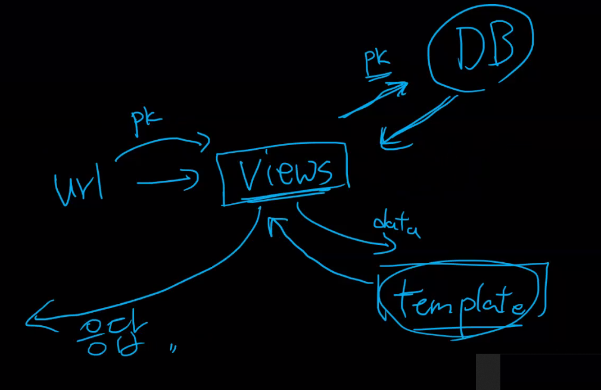

> 2021.09.02 CRUD 실습 중

# Admin Site

> Automatic admin interface

* 사용자가 아닌 서버의 관리자가 활용하기 위한 페이지

* Model class를 `admin.py`에 등록하고 관리

* django.contrib.auth 모듈에서 제공됨

* record 확인에 유용 (삽입도 가능)

  관리자 계정 생성 코드

```
$ python manage.py createsuperuser
```

#### admin 등록

```python
# articles/admin.py

from django.contrib import admin
from .models import Article

class ArticleAdmin(admin.ModelAdmin):
    list_display = ('pk', 'title',)

# admin site에 register하겠다.
admin.site.register(Article, ArticleAdmin)
```

* Article 객체가 관리자 인터페이스를 가지고 있다는 것을 알려준다 

**ModelAdmin options**

> •[https://docs.djangoproject.com/en/3.2/ref/contrib/admin/#modeladmin-options](https://docs.djangoproject.com/en/3.2/ref/contrib/admin/)

`list_display`

- models.py 정의한 각각의 속성(컬럼)들의 값(레코드)를 admin 페이지에 출력하도록 설정

  ```python
  # articles/admin.py
  
  from django.contrib import admin
  from .models import Article
  
  class ArticleAdmin(admin.ModelAdmin):
      list_display = ('pk', 'title', 'content', 'created_at', 'updated_at',)
  
  admin.site.register(Article, ArticleAdmin)
  ```

---

# `redirect()`

> Django shortcut function

* 새 URL로 되돌림
* 인자에 따라 HttpResponseRedirect를 반환
* 브라우저는 현재 경로에 따라 전체 URL 자체를 재구성

```python
# views.py
from django.shortcuts import render, redirect

def create(request):
    ...
    return redirect('articles:index') # index로
```

---

# Variable Routing

```python
# index.html
...
    <a href= "">DETAIL</a>
...
# urls.py
urlpatterns = [
    ...
    path('detail/<pk>/', views.detail, name='detail'),
  	...
]
# views.py
def detail(request, pk):
    article = Article.objects.get(pk=pk)
    ...
```




