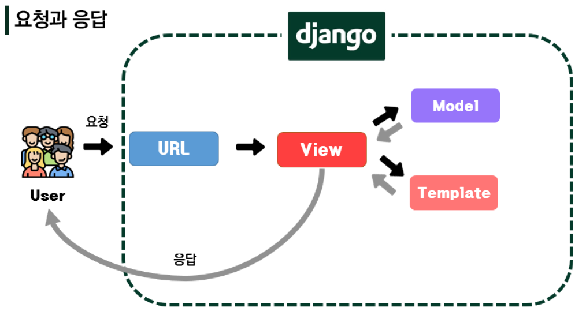

# Django

> Python 언어 기반 Web framework
>
> 대규모 서비스에도 안정적이며 오랫동안 세계적인 기업들에 의해 사용됨

# Framwork Architecture

## MVC Design Pattern 

> Model - View - Controller

# MTV Pattern

> Model - Template - View

* Model
  * 응용프로그램의 데이터 구조를 정의하고 **데이터베이스**의 기록을 관리 (추가, 수정, 삭제)

* Template
  * 파일의 구조나 레이아웃을 정의
  * 실제 내용을 보여주는 데 사용
* View
  * HTTP 요청을 수신하고  HTTP응답을 반환
  * Model과 Template를 관리, 컨트롤

| MVC Pattern | MTV (Django) |
| ----------- | ------------ |
| Model       | Model        |
| View        | Template     |
| Controller  | View         |

---

# Django Intro

```
# 가상환경 생성
$ python -m venv venv

# 가상환경 활성화
$ source venv/Scripts/activate

# django 설치 
$ pip install django

# 설치 확인
$ pip list
# python -m django --version
```

```
# project 생성
$ django-admin startproject config .

# django 서버 실행
$ python manage.py runserver # 로켓 확인
```

```
# application 생성
$ python manage.py startapp <articles> # 복수형 권장
```

프로젝트에서 앱을 사용하기 위해 `config - settings - INSTALLED_APPS 리스트 - application (articles)` 등록

```python
# settings.py

INSTALLED_APPS = [
		'articles',
    'django.contrib.admin',
    'django.contrib.auth',
    'django.contrib.contenttypes',
    'django.contrib.sessions',
    'django.contrib.messages',
    'django.contrib.staticfiles',
]
```

* INSTALLED_APPS의 app order

```python
INSTALLED_APPS = [
    # Local apps
    'blogs.apps.BlogsConfig',

    # Third party apps
    'haystack',

    # Django apps
    'django.contrib.admin',
    'django.contrib.auth',
    'django.contrib.contenttypes',
    'django.contrib.sessions',
    'django.contrib.sites',
]
```

**Internationalization**

> https://docs.djangoproject.com/en/3.1/topics/i18n/

```
# settings.py

LANGUAGE_CODE = 'ko-kr'

TIME_ZONE = 'Asia/Seoul'
```

### 프로젝트 구조

> Project는 Application의 집합 collection of apps)

* `__init__.py`
  * python 패키지로 다루도록 지시
* `asgi.py`
  * Asynchronous Server Gateway Interface
  * 웹 서버와 연결 및 소통하는 것을 도움
* `settings.py`
  * 설정
* `urls.py`
  * 사이트의 url과 적절한 views의 연결을 지정
* `wsgi.py`
  * Web Server Gateway Interface
* `manage.py`

### Application 구조

> 앱은 실제 요청을 처리하고 페이지를 보여주고 하는 등의 역할을 담당

* `admin.py`
* `apps.py`
* `models.py`
  * 앱에서 사용하는 Model 정의
* `test.py`
* `views.py`

---

## 코드 작성 순서

> 데이터 흐름에 맞추어 작성




### 1. urls.py

`urls.py -  urlpatterns - path` 등록

### 2. vies.py

`<app> - views.py`에 함수 등록 (반드시 `request`를 첫번째 매개변수로 등록해야함)

```python
def index(request):
	return render(request, 'index.html')
```

### 3. templates

`<app>/templates/.html`  *TemplatesDoseNotExist 오타, 잘못된 위치 주의*

---


# Template

# Static web page

> 정적 웹 페이지

# Dynamic web page

> 동적 웹 페이지
>
> 방문자와 상호작용 -> 페이지 내용 그때그때 다름

## Django Template

> **D**jango **T**emplate **L**anguage, **DTL**
>
> built-in template system

:pushpin: [Django Built-in] https://docs.djangoproject.com/en/3.2/ref/templates/builtins/

```django
# Variable

{{ variable }}
```

```django
# Filters

{{ variable|filter }}
```

```django
# Tags

{}
```

```django
# Comments

{# #}
```

---

# Template Inheritance

> https://docs.djangoproject.com/ko/3.1/ref/templates/language/#template-inheritance

**템플릿 상속**

- 템플릿 상속은 기본적으로 코드의 재사용성에 초점을 맞춘다.

**작성**

- `base.html` 파일을 `firstapp/templates/base.html` 에 생성

- Django는 기본적으로 `<app>/templates` 를 바라보게 설정되어있다. (`APP_DIRS=True` 설정)

- 우리가 옮긴 위치는 `project폴더/templates` 이므로, Django는 현재 상태에서 해당 template 파일을 찾을 수 없다.

- 각 앱 내의 `templates` 폴더가 아닌 임의의 위치에 있는 template을 읽기 위해서는 Django에서 그 위치를 알려줘야 한다.

  ```python
  TEMPLATES = [
      {
          'BACKEND': 'django.template.backends.django.DjangoTemplates',
          'DIRS': [BASE_DIR / 'first_project' / 'templates'],
          ...,
  ]
  ```

**템플릿 상속을 위한 기본 세팅**

- 프로젝트 폴더에서 `templates` 폴더 만든 후에 `base.html` 파일 생성

  ```html
  <!-- firstapp/templates/base.html -->
  
  <!DOCTYPE html>
  <html lang="en">
  <head>
    <meta charset="UTF-8">
    <meta name="viewport" content="width=device-width, initial-scale=1.0">
    <link rel="stylesheet" href="<https://stackpath.bootstrapcdn.com/bootstrap/4.5.2/css/bootstrap.min.css>" integrity="sha384-JcKb8q3iqJ61gNV9KGb8thSsNjpSL0n8PARn9HuZOnIxN0hoP+VmmDGMN5t9UJ0Z" crossorigin="anonymous">
    <title>Document</title>
  </head>
  <body>
    <h1 class="text-center">Template Inheritance</h1>
    <hr>
    <div class="container">
      
      
    </div>
    <script src="<https://code.jquery.com/jquery-3.5.1.slim.min.js>" integrity="sha384-DfXdz2htPH0lsSSs5nCTpuj/zy4C+OGpamoFVy38MVBnE+IbbVYUew+OrCXaRkfj" crossorigin="anonymous"></script>
    <script src="<https://cdn.jsdelivr.net/npm/popper.js@1.16.1/dist/umd/popper.min.js>" integrity="sha384-9/reFTGAW83EW2RDu2S0VKaIzap3H66lZH81PoYlFhbGU+6BZp6G7niu735Sk7lN" crossorigin="anonymous"></script>
    <script src="<https://stackpath.bootstrapcdn.com/bootstrap/4.5.2/js/bootstrap.min.js>" integrity="sha384-B4gt1jrGC7Jh4AgTPSdUtOBvfO8shuf57BaghqFfPlYxofvL8/KUEfYiJOMMV+rV" crossorigin="anonymous"></script>
  </body>
  </html>
  ```

### `block` tag

- 하위 템플릿에서 재 지정(overriden)할 수있는 블록을 정의
- 하위 템플릿이 채울 수 있는 공간

### `extends` tag

- 이(자식) 템플릿이 부모 템플릿을 확장한다는 것을 알림

- `` 는 반드시 문서의 최상단에 위치해야 한다.

  ```
  
  
  
    <h1>안녕하세요! 반갑습니다!!</h1>
  
  ```

**django 설계 철학 (Template)**

> https://docs.djangoproject.com/ko/3.1/misc/design-philosophies/#template-system

- 표현과 로직(view)을 분리

  - 우리는 템플릿 시스템이 `표현`을 제어하는 도구이자 표현에 관련된 로직일 뿐이라고 본다.
  - 템플릿 시스템은 이러한 기본 목표를 넘어서는 기능을 지원하지 말아야 한다,

- 중복을 배제

  - 대다수의 동적 웹사이트는 공통 헤더, 푸터, 네이게이션 바 같은 사이트 공통 디자인을 갖는다.

    Django 템플릿 시스템은 이러한 요소를 한 곳에 저장하기 쉽게 하여 중복 코드를 없애야 한다.

  - 이것이 `템플릿 상속`의 기초가 되는 철학

---

# HTML Form

**Form**

- 사용자로부터 할당된 데이터를 서버로 전송하는 역할을 담당하는 HTML 태그
- form은 한 페이지에서 다른 페이지로 데이터를 전달하기 위해서 사용한다.
- 핵심 속성
  - `action` —> 입력 데이터가 **전송될 URL** 지정
  - `method`—> 입력 데이터 **전달 방식** 지정

**Input**

- form 태그 중에서 가장 중요한 태그로 **사용자로부터 데이터를 입력 받기 위해** 사용
- input 태그의 속성
  - `name`
    - 중복 가능, form을 제출했을 때 name이라는 이름에 설정된 값을 넘겨서 값을 가져올 수 있다.
    - 주요 용도는 GET/POST 방식으로 서버에 전달하는 파라미터(name 은 key , value 는 value)로 `?key=value&key=value` 형태로 전달된다.

**HTTP method `GET`**

> https://developer.mozilla.org/ko/docs/Web/HTTP/Methods

- 서버로부터 **정보를 조회**하는 데 사용

* 서버의 데이터나 상태를 변경 시키지 않아야 하기 때문에 조회(html)를 할 때 사용
* 우리는 서버에 요청을 하면 HTML 문서 파일 한 장을 받는데 이때 사용하는 요청의 방식이 GET 방식이다.

### throw & catch 실습

- throw

  ```python
  # first_project/urls.py
  
  path('throw/', views.throw),
  ```

  ```python
  # articles/views.py 
  
  def throw(request):
      return render(request, 'throw.html')
  ```

  ```python
  <!-- articles/templates/throw.html -->
  
  <form action="/catch/" method="GET">
    <label for="message">Throw</label>
    <input type="text" id="message" name="message">
    <input type="submit">
  </form>
  ```

- catch

  ```python
  # first_project/urls.py
  
  path('catch/', views.catch),
  ```

  ```python
  # articles/views.py
  
  def catch(request):
      message = request.GET.get('message')
      context = {
          'message': message,
      }
      return render(request, 'catch.html', context)
  ```

  ```python
  <!-- articles/templates/catch.html -->
  
  <h1>너가 던져서 내가 받은건 {{ message }}야!</h1>
  <a href="/throw/">뒤로</a>
  ```

