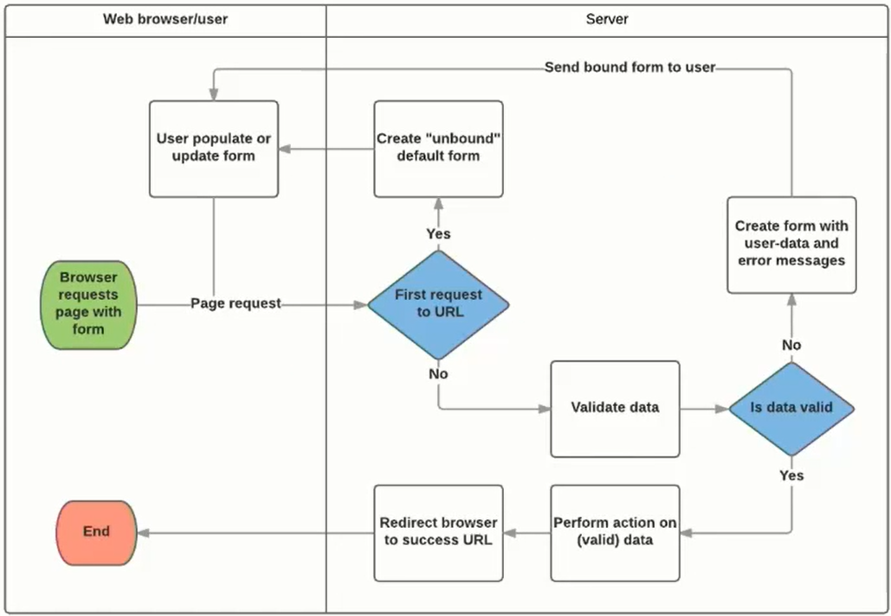

# 03. django_form

> 2021.09.06

## Intro

>  Django 프로젝트의 주요 **유효성 검사 도구**들 중 하나 

* 공격 및 유연한 데이터 손상에 대한 중요한 방어수단
* 우리는 지금까지 HTML form, input을 통해서 사용자로부터 데이터를 받았다
* 이렇게 직접 사용자의 데이터를 받으면 입력된 데이터의 유효성을 검증하고, 필요시에 입력된 데이터를 검증 결과와 함께 다시 표시하며, 유효한 데이터에 대해 요구되는 동작을 수행하는 것을 "올바르게 하기" 위해서는 꽤 많은 노력이 필요한 작업이다
* Django는 일부 과중한 작업과 반복 코드를 줄여줌으로써, 이 작업을 훨씬 쉽게 만든다

## Django's role in forms

Form에 관련된 작업의 아래 세 부분을 처리해 줌

1. 렌더링을 위한 데이터 준비 및 재구성
2. 데이터에 대한 HTML forms 생성
3. 클라이언트로부터 받은 데이터 수신 및 처리

---

# Form Class

> Django Form 관리 시스템의 핵심

* Form 클래스는 form내 field들, field 배치, 디스플레이 widget, label, 초기값, 유효한 값과 (유효성 체크 이후에) 비유효 field에 관련된 에러메시지를 결정한다

## Django's role in forms

Django는 forms에 관련된 작업의 세 부분을 처리한다.

1. 렌더링을 위한 데이터 준비 및 재구성
2. 데이터에 대한 HTML forms 생성
3. 클라이언트로 부터 받은 데이터 수신 및 처리

이 모든 작업을 수동으로 수행하는 코드를 작성할 수 있지만 Django가 모든 작업을 처리 할 수 있다.


## Form Class

> https://docs.djangoproject.com/ko/3.1/topics/forms/#working-with-forms

- `Form` 클래스는 Django form 관리 시스템의 핵심이다. Form 클래스는 form내 field들, field 배치, 디스플레이 widget, label, 초기값, 유효한 값과 (유효성 체크 이후에) 비유효 field에 관련된 에러메시지를 결정한다.

#### 들어가기 전

- `Form` 을 선언하는 문법은 `Model` 을 선언하는 것과 비슷하고 같은 필드 타입을 사용한다. (또한, 일부 매개변수도 유사하다.)

### Form 선언

* Form을 생성하기 위해, Form클래스에서 파생된, `forms` 라이브러리를 import 하고 폼 필드를 생성한다.

* view까지 작성해서 템플릿에서 출력까지 확인.

  ```python
  # articles/forms.py
  
  from django import forms
  
  class ArticleForm(forms.Form):
      title = forms.CharField(max_length=10)
      content = forms.CharField(widget=forms.Textarea)
  ```

  ```python
  # articles/views.py
  
  from .forms import ArticleForm
  
  def new(request):
      form = ArticleForm()
      context = {
          'form': form,
      }
      return render(request, 'articles/new.html', context)
  ```

  ```django
  <!-- articles/new.html -->
  
  
  
  
    <h1 class="text-center">NEW</h1>
    <form action="" method="POST">
      
      {{ form.as_p }}
      <input type="submit">
    </form>
    <hr>
    <a href="">[back]</a>
  
  ```

  - 개발자 도구로 만들어진 input 태그 확인


#### Outputting forms as HTML

> https://docs.djangoproject.com/ko/2.2/ref/forms/api/#outputting-forms-as-html

- `as_p()` : 각 필드가 단락(paragraph)으로 렌더링
- `as_ul()` : 각 필드가 목록항목(list item)으로 렌더링
- `as_table()` : 각 필드가 테이블 행으로 렌더링


#### form fields

- 입력 유효성 검사 논리를 처리하며 템플릿에서 직접 사용됨


#### widget

> Django의 HTML input element 표현 
>
> https://docs.djangoproject.com/en/3.1/ref/forms/widgets/#module-django.forms.widgets

- 하지만 위젯은 반드시 form fields에 할당 됨
- 위젯을 form fields와 혼동해서는 안됨
- 웹페이지에서 input element의 단순 raw한 렌더링 처리


### Form fields

> https://docs.djangoproject.com/en/3.1/ref/forms/fields/#module-django.forms.fields

```python
class ArticleForm(forms.Form):
    REGION_A = 'sl'
    REGION_B = 'dj'
    REGION_C = 'gj'
    REGION_D = 'gm'
    REGION_E = 'bs'
    REGIONS = [
        (REGION_A, '서울'),
        (REGION_B, '대전'),
        (REGION_C, '광주'),
        (REGION_D, '구미'),
        (REGION_E, '부산'),
    ]
    title = forms.CharField(max_length=10)
    content = forms.CharField(widget=forms.Textarea)
    region = forms.ChoiceField(choices=REGIONS, widget=forms.RadioSelect())
```

---

# ModelForm

> https://docs.djangoproject.com/en/3.1/topics/forms/modelforms/#creating-forms-from-models

- 하지만 Model에 이미 필드를 정의했기 때문에 다시 필드 유형을 재정의하는 중복된 행위 발생

- Django에서는 model을 통해 Form Class를 만들수 있는 Helper를 제공

  - ModelForm은 일반 Form과 완전히 같은 방식(객체생성)으로 view에서 사용 가능

  ```python
  # articles/forms.py
  
  from django import forms
  from .models import Article
  
  class ArticleForm(forms.ModelForm):
  
      class Meta:
          model = Article
          fields = '__all__' # 화이트 리스트
          # exclude = ('title',) # 블랙리스트
  ```

### CREATE

```python
# articles/views.py

def create(request):
    form = ArticleForm(request.POST) 
    if form.is_valid():
        article = form.save()
        return redirect('articles:detail', article.pk)
    return redirect('articles:new')
```


### view 합치기

```python
# articles/forms.py

def create(request):
    # POST 부터 먼저 한 이유?
    if request.method == 'POST':
        form = ArticleForm(request.POST) 
        if form.is_valid():
            article = form.save()
            return redirect('articles:detail', article.pk)
    else:
        form = ArticleForm()
    # 유효성 검사에 통과하지 못 한 경우를 위해 들여쓰기 하지 않음
    context = {
        'form': form,
    }
    return render(request, 'articles/create.html', context)
```

> new view 함수, url 삭제
>
> new.html → `create.html` 이름변경

- input 태그에 데이터를 공백으로 넣어보고 글 작성 후 에러 메세지 출력 확인

### Widgets

> https://docs.djangoproject.com/en/3.1/ref/forms/widgets/#module-django.forms.widgets

1. 첫번째 방식

   ```python
   class ArticleForm(forms.ModelForm):
   
       class Meta:
           model = Article
           fields = '__all__'
           widgets = {
               'title': forms.TextInput(attrs={
                   'class': 'title',
                   'placeholder': 'Enter the title',
                   'maxlength': 10,
                   }
               )
           }
   ```

2. 두번째 방식 **(권장)**

   ```python
   class ArticleForm(forms.ModelForm):
       title = forms.CharField(
           label='제목',
           widget=forms.TextInput(
               attrs={
                   'class' : 'my-title',
                   'placeholder' : 'Enter the title',
                   'maxlength' : 10,
               }
           )
       )
       content = forms.CharField(
           label='내용',
           widget=forms.Textarea(
               attrs={
                   'class' : 'my-content',
                   'placeholder' : 'Enter the content',
                   'rows' : 5,
                   'cols' : 50,
               }
           )
       )
       
       class Meta:
           model = Article
           fields = '__all__'
   ```

#### The `save()` method

> https://docs.djangoproject.com/ko/3.1/topics/forms/modelforms/#the-save-method

* form에 바인딩 된 데이터에서 데이터베이스 객체를 만들고 저장
* ModelForm의 하위(sub) 클래스는 기존 모델 인스턴스를 키워드 인자 `instance`로 받아 들일 수 있음

### Update

- 인자 `instance`는 **수정 대상이 되는 객체를 지정**한다.

- create 로직과 다른 점은 기존의 데이터를 가져와 수정을 한다는 점이다.

  `article` 인스턴스를 DB에서 가져와, ArticleForm에 `instance` 의 인자로 넣는다.

  - `request.POST` : 사용자가 form을 통해 전송한 데이터
  - `instance` : 수정이 되는 대상

```python
def update(request, pk):
    article = Article.objects.get(pk=pk)
    # update
    if request.method == 'POST':
        form = ArticleForm(request.POST, instance=article)
        if form.is_valid():
            form.save()
            return redirect('articles:detail', article.pk)
    # edit
    else:
        form = ArticleForm(instance=article)
    context = {
        'article': article,
        'form': form
    }
    return render(request, 'articles/edit.html', context)
```

> edit view 함수, url 삭제
>
> edit.html → `update.html` 이름변경

#### Form과 ModelForm의 핵심 차이점

- Form
  - 어떤 모델에 저장해야 하는지 알 수 없기 때문에 유효성 검사를 하고 실제로 DB에 저장할 때는 `cleaned_data` 와 `article = Article(title=title, content=content)` 를 사용해서 따로 `.save()` 를 해야 한다.
  - Form Class가 `cleaned_data` 로 딕셔너리로 만들어서 제공해 주고, 우리는 `.get` 으로 가져와서 Article 을 만드는데 사용한다.
- ModelForm
  - django 가 해당 모델에서 양식에 필요한 대부분의 정보를 이미 정의한다.
  - `forms.py` 에 Meta 정보로 `models.py` 에 이미 정의한 Article 을 넘겼기 때문에 어떤 모델에 레코드를 만들어야 할지 알고 있어서 바로 `.save()` 가 가능하다.

---

# Rendering fields manually

> https://docs.djangoproject.com/ko/3.1/topics/forms/#rendering-fields-manually

### Form 분리

1. Rendering fields manually

   ```django
   <!-- articles/create.html --> 
   
   <h1>CREATE</h1>
   ...
   <hr>
   
   <form action="" method="POST">
     
     <div>
       {{ form.title.errors }}
       {{ form.title.label_tag }}
       {{ form.title }}
     </div>
     <div>
       {{ form.content.errors }}
       {{ form.content.label_tag }}
       {{ form.content }}
     </div>
     <button class="btn btn-primary">작성</button>
   </form>
   ```

2. Looping over the form’s fields (``)

   ```django
   <!-- articles/create.html --> 
   
   ...
   
   <hr>
   
   <form action="" method="POST">
     
     
       {{ field.errors }}
       {{ field.label_tag }}
       {{ field }}
     
     <button class="btn btn-primary">작성</button>
   </form>
   ```


### Bootstrap Form

> https://getbootstrap.com/docs/4.5/components/forms/

```django
<!-- articles/create.html -->

...

<hr>

<h2>Bootstrap Form</h2>
<form action="" method="POST">
  
  
    <div class="form-group">
      {{ field.errors }}
      {{ field.label_tag }} 
      {{ field }}
    </div>
  
  <button class="btn btn-primary">작성</button>
</form>
```


### Error message with Bootstrap

```django
<form action="" method="POST">
  
  
    
      
        <div class="alert alert-warning" role="alert">{{ error|escape }}</div>
      
    
    <div class="form-group">
      {{ field.label_tag }} 
      {{ field }}
    </div>
  
  <button class="btn btn-primary">작성</button>
</form>
```

------

## Django Bootstrap Library


### django-bootstrap4

> https://django-bootstrap4.readthedocs.io/en/latest/installation.html
>
> https://pypi.org/project/django-bootstrap4/

- 공식 문서를 같이 따라가며 이것저것 사용 해보자.

  ```
  $ pip install django-bootstrap5
  ```

  ```python
  # settings.py
  
  INSTALLED_APPS = [
    ...
    'bootstrap5',
  	...
  ]
  ```

  ```django
  <!-- articles/base.html -->
  
  
  
  <!DOCTYPE html>
  <html lang="ko">
  <head>
    <meta charset="UTF-8">
    <meta name="viewport" content="width=device-width, initial-scale=1.0">
    
    <title>Document</title>
  </head>
  <body>
    <div class="container">
      
      
    </div>
    
  </body>
  </html>
  ```

  ```django
  <!-- articles/update.html -->
  
  
  
  
  
    ...
    <form action="" method="POST">
      
      
      
    </form>
    ...
    
  
  ```

---

# Handling HTTP requests

> Django에서 HTTP 요청을 처리하는 방법
>
> 1. Django shortcut functions
> 2. View decorators 

### 1. Django shortcut functions

* `render()`
* `redirect()`
* `get_object_or_404()`
* `get_list_or_404()`

#### `get_object_or_404()`

> https://developer.mozilla.org/ko/docs/Web/HTTP/Status

* 해당 객체가 없을 경우 `DoesNotExist` 예외 대신 Http 404를 raise
* 코드 실행 단계에서 발생한 에러에 대해서 브라우저는 http status code 500으로 인식함


* 상황에 따라 적절한 예외처리를 하고 클라이언트에게 올바른 에러를 전달하는 것 또한 개발의 중요한 요소 중 하나

```python
from django.shortcuts import render, redirect, get_object_or_404

def detail(request, pk):
    # article = Article.objects.get(pk=pk) # 500 리턴
    article = get_object_or_404(Article, pk=pk) # 404 리턴
    ...
```


### 2. View decorators 

> https://docs.djangoproject.com/en/3.2/topics/http/decorators/

* django는 다양한 HTTP 기능을 지원하기 위해 뷰에 적용할 수 있는 여러 데코레이터를 제공
* [참고] Decorator
  * 해당 함수를 수정하지 않고 기능을 연장해주는 함수
* Allowed HTTP methods
  * 요청이 조건을 충족시키지 못하면 `HttpResponseNotAllowed`을 return (405)


#### `require_http_methods()`

- view가 특정한 요청 method만 허용하도록하는 데코레이터

  ```python
  from django.views.decorators.http import require_http_methods, require_POST
  
  
  @require_http_methods(['GET', 'POST'])
  def create(request):
      pass
  
    
  @require_http_methods(['GET', 'POST'])
  def update(request, pk):
      pass
  ```

#### `require_POST()`

- view가 POST 메서드만 요청만 승인하도록 하는 데코레이터

  ```python
  from django.views.decorators.http import require_http_methods, require_POST
  
  
  @require_POST
  def delete(request, pk):
      article = Article.objects.get(pk=pk)
      article.delete()
      return redirect('articles:index')
  ```

  - url 로 delete 시도 후 405 에러페이지 & terminal 로그 확인하기

---

## From의 역할 2가지

1. data validation(유효성 검사)
2. HTML(<input>) 생성

## Django (Model)Form workflow

> 순서, 흐름을 기억하자



