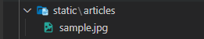
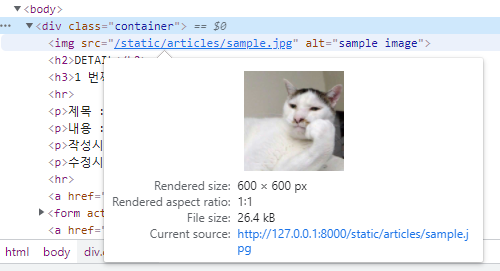
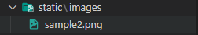
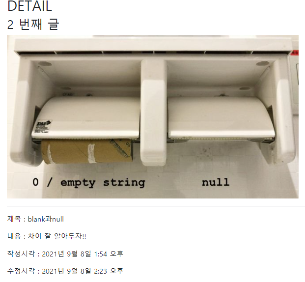
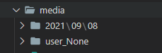

# 03. django_static_media

> 2021.09.08

# Static

> "정적 파일"
>
> 웹 사이트의 구성 요소 중에서 image, css, js 파일과 같이 해당 내용이 고정되어 응답을 할 때 별도의 처리 없이 파일 내용을 그대로 보여주면 되는 파일

- 사용자의 요청에 따라 내용이 바뀌는 것이 아니라 요청한 것을 그대로 내어 주면 되는 파일
- django 는 기본적으로 static 위치를 `app_name/static/`로 알고 있다.

#### STATIC_ROOT

* `collectstatic`이 배포를 위해 정적 파일을 수집하는 디렉토리의 절대 경로
* 프로젝트에서 사용하는 모든 정적 파일을 한 곳에 모아 넣는 경로
* `settig.py`의 `DEBUG` 값이 `True`로 설정되어 있으면 작용 x

#### STATIC_URL

* STATIC_ROOT에 있는 정적 파일을 참조할 때 사용할 URL
* 개발 단계에서 사용
* 실제 파일이나 디렉토리가 아니며, URL로만 존재 
* 비어 있지 않은 값으로 설정한다면 반드시 slash`/`로 끝나야 함

```python
STATIC_URL = '/static/'
```

#### STATICFILES_DIRS

* app/static/디렉토리 경로를 사용하는 것(기본 경로) 외에 추가적인 정적 파일 경로 목록을 정의하는 리스트

```python
STATICFILES_DIRS = [
    BASE_DIR / 'static'
]
```

---



- `articles/static/articles/image.jpg/` 폴더를 만들고 샘플 이미지를 넣어보자

  ```django
  <!-- articles/detail.html -->
  
  
  
  
  
    
  
  ```



* `Current source` = STATIC_URL

---



```django
<!-- base.html -->

<body>
  
```

```python
# settings.py

STATICFILES_DIRS = [
    BASE_DIR / 'static',
]
```

---

# Media

> 사용자가 웹에서 올리는 파일 파일 자체는 고정 이지만, 언제/어떤 파일이 정적 파일로 제공 되는지는 예측할 수 없는 파일

### Image Field

> https://docs.djangoproject.com/ko/3.1/ref/models/fields/#filefield

- `FileField`의 상속을 받음

- `Article` 모델에 새로운 컬럼 추가

  - image 컬럼 코드를 기존 컬럼 코드 사이에 넣어도 추가 될 때는 제일 우측(뒤)에 추가된다.

  ```python
  class Article(models.Model):
      title = models.CharField(max_length=20)
      content = models.TextField()
      image = models.ImageField(blank=True, upload_to='images/')
      created_at = models.DateTimeField(auto_now_add=True)
      updated_at = models.DateTimeField(auto_now=True)
  ```

  ```python
  # crud/urls.py
  
  from django.conf import settings
  from django.conf.urls.static import static
  
  urlpatterns = [
      path('admin/', admin.site.urls),
      path('articles/', include('articles.urls')),
      path('accounts/', include('accounts.urls')),
  ] + static(settings.MEDIA_URL, document_root=settings.MEDIA_ROOT)
  ```

  ```
  $ python manage.py makemigrations
  $ pip install Pillow
  
  $ python manage.py makemigrations
  $ python manage.py migrate
  ```

  - 이미지 작성 input이 생성되었는지 확인.

> **null / blank / default 옵션**
>
> 1. 두 가지 필드의 옵션은 비슷한 역할을 하지만 차이점이 있다.
>
>    - **Null** : **DB와 관련**되어 있다.(Database-related) 주어진 데이터베이스 컬럼이 Null을 가질 것인지를 결정한다.
>    - **Blank**: **데이터 유효성**과 관련되어 있다. (Validation-related) `form.is_valid()` 가 호출될 때 폼 유효성 검사에 사용된다.
>
> 2. 위와 같은 정의에 의하여 `null=True, blank=False` 옵션을 하나의 필드 내에서 사용하는 것은 문제가 없다. DB에서는 해당 필드가 NULL을 허용하지만, application에서는 input 태그의 `required` 필드 인 것을 의미한다.
>
> 3. 주의사항
>
>    - `CharField()` 와 `TextField()` 와 같은 문자열 기반 필드에 `null=True` 를 정의하면 안된다.
>    - 이렇게 설정을 하게 되면 '데이터 없음'에 두 가지의 값, None과 빈 문자열을 갖게 된다. '데이터 없음'에 대해 두 가지 값을 갖는 것은 중복이다. Null이 아닌 빈 스트링을 사용하는 것이 장고 컨벤션이다.
>    - **문자열 기반 필드에 `null=True` 금지**
>
> 4. 만약 문자열 기반 모델 필드를 'nullable' 하게 만들고 싶으면 아래와 같이 설정하자.
>
>    ```python
>    class Person(models.Model):
>    	name = models.CharField(max_length=25)
>    	bio = models.TextField(max_length=50, blank=True) # null=True는 X
>    	birth_date = models.DateField(null=True, blank=True) # null=True 설정 가능 -> 문자열 기반 필드가 아니기 때문
>    ```
>
>    - null과 blank 옵션의 디폴트는 False이다.
>    - 만약, `BooleanField` 에서 Null을 받고 싶다면, 위젯으로`NullBooleanSelect` 사용 (if `null=True`)

## MEDIA_in settings

#### `MEDIA_ROOT`

> https://docs.djangoproject.com/ko/3.1/ref/settings/#media-root

- 업로드가 끝난 파일을 배치할 최상위 경로를 지정하는 설정이다.

- `STATICFILES_DIRS` 과 비슷한 역할을 한다. (실제 해당 파일의 업로드가 끝나면 어디에 파일이 저장되게 할 지 경로)

- `MEDIA_ROOT` 는 `STATIC_ROOT` 와 다른 경로로 지정을 해야 한다.

  ```python
  # settings.py
  MEDIA_ROOT = BASE_DIR / 'media'
  ```

#### `MEDIA_URL`

> https://docs.djangoproject.com/ko/3.1/ref/settings/#media-url

- `STATIC_URL` 과 역할이 비슷하다. 업로드 된 파일의 주소(URL)를 만들어 주는 역할.

- `/` 이 필수이고 문자열로 설정해야 한다.

- `MEDIA_URL` 도 `MEDIA_ROOT` 와 마찬가지로 `STATIC_URL` 과 URL 경로가 달라야 한다.

- 아무 값이나 작성해도 된다. 하지만 일반적으로 `/media/` 를 사용함

  ```python
  # settings.py
  MEDIA_URL = '/media/' 
  ```

### Create

- 파일을 사용자에게 받으려면 추가 메서드 설정이 필요하다.

  - form 태그 `enctype(인코딩)` 메서드

    > https://developer.mozilla.org/ko/docs/Web/HTML/Element/form

    1. `apllication/x-www-form-urlencoded` : (기본값) 모든 문자 인코딩
    2. `multipart/form-data` : 파일/이미지 업로드 시에 반드시 사용해야 한다. (전송되는 데이터의 형식을 지정한다.
    3. `text/plain` : 인코딩을 하지 않은 문자 상태로 전송. 공백은 '+' 기호로 변환하지만, 특수 문자는 인코딩 하지 않음.

  ```django
  <!-- articles/create.html -->
  
  <form action="" method="POST" enctype="multipart/form-data">
    
    {{ form.as_p }}
    <input type="submit">
  </form>
  ```

  ```python
  # articles/views.py
  
  @require_http_methods(['GET', 'POST'])
  def create(request):
      if request.method == 'POST':
          form = ArticleForm(request.POST, request.FILES)
          if form.is_valid():
              article.save()
              return redirect('articles:detail', article.pk)
      else: 
          form = ArticleForm()
      context = {
          'form': form,
      }
      return render(request, 'articles/create.html', context)
  ```


### Read

- `article.image.url` - 파일의 주소
- `article.image` - 파일 이름

```django
<!-- articles/detail.html -->




  <h2 class='text-center'>DETAIL</h2>
  <h3>{{ article.pk }} 번째 글</h3>
  
  <hr>
  ...

```

### Update

- 이미지는 바이너리 데이터(하나의 덩어리)라서 텍스트처럼 *일부만 수정 하는게 불가능*하다. 그렇기 때문에 `Input value` 에 넣어서 수정하는 방식을 사용하는 게 아니고, 새로운 사진으로 덮어 씌우는 방식을 사용한다.

- 실제 수정을 진행 해보고 이미지가 잘 수정 되었는지 확인하기

  ```django
  <!-- articles/update.html -->
  
  
    <h1 class="text-center">UPDATE</h1>
    <form action="" method="POST" enctype="multipart/form-data">
      
      
      
    </form>
    <hr>
    <a href="">[back]</a>
  
  ```

  ```python
  def update(request, pk):
      ...
      if request.method == 'POST':
          form = ArticleForm(request.POST, request.FILES, instance=article)
      ...
  ```

### 추가 설정

- 한가지 문제가 생긴다. 이미지 필드 설정 이전에 올렸던 이전 게시물들을 보여주는 detail 페이지에서 image 속성을 읽어 오지 못해 페이지를 띄우지 못한다. if 문 분기를 통해 이를 해결할 수 있다.

  ```django
  <!-- articles/detail.html -->
  
  
  
  
    <h1>DETAIL</h1>
    <h2>{{ article.pk }} 번째 글</h2>
    
      
    
  ```



---

## 이미지 업로드 경로 설정

> https://docs.djangoproject.com/ko/3.1/ref/models/fields/#filefield

- 지금까지는 고정적인 폴더에 이미지가 업로드 되도록 작성했다.
- 이러면 하나의 폴더에 모든 이미지가 업로드 되어 추후에 관리가 어렵다.
- 소개하는 2가지 방법을 참고해보자.

1. 날짜로 분류해보기

   ```python
   # models.py
   
   class Article(models.Model):
       title = models.CharField(max_length=20)
       content = models.TextField()
       image = models.ImageField(blank=True, upload_to='%Y/%m/%d/')
       created_at = models.DateTimeField(auto_now_add=True)
       updated_at = models.DateTimeField(auto_now=True)
   ```

   ```
   $ python manage.py makemigrations
   $ python manage.py migrate
   ```

2. FileField에 정의된 모델 인스턴스 사용 (참고)

   ```python
   # models.py
   
   def articles_image_path(instance, filename):
       return f'user_{instance.user.pk}/{filename}'
   
   class Article(models.Model):
       title = models.CharField(max_length=20)
       content = models.TextField()
       image = models.ImageField(blank=True, upload_to=articles_image_path)
       created_at = models.DateTimeField(auto_now_add=True)
       updated_at = models.DateTimeField(auto_now=True)
   ```

   ```
   $ python manage.py makemigrations
   $ python manage.py migrate
   ```

   - `instance` --> instance는 Article 모델의 객체
   - `filename` --> 업로드한 이미지 파일의 이름



------

## Image Resizing

> - `Pillow`
>   - Pillow는 PIL 프로젝트에서 fork 되어서 나온 라이브러리.
>   - PIL이 Python3를 지원하지 않기 때문에 Pillow를 많이 씀.(`ImageField()` 사용시에 필수 라이브러리)
> - `pilkit`
>   - Pillow를 쉽게 쓸 수 있도록 도와주는 라이브러리. 다양한 Processors 지원
>   - https://github.com/matthewwithanm/pilkit/tree/master/pilkit/processors
>   - Thumbnail
>   - Resize
>   - Crop
> - `django-imagekit`
>   - 이미지 썸네일 helper Django 앱(실제 이미지를 처리할 때는 Pilkit을 사용)
>   - 이미지 썸네일 helper 장고 앱


### 이미지 사이즈 조절

- detail 페이지를 보게 되면, 이미지가 원본 그대로 업로드 되어서 너무 크거나 너무 작다.

- 또한, 실제 원본 이미지를 서버에 그대로 로드 할 경우 문제가 비용 문제가 생긴다.

- html img 태그에서 직접 사이즈를 조정할 수도 있지만(`width` 와 `height` 로 조정), 용량 문제도 있기 때문에 업로드 될 때의 이미지 자체를 resizing 할 필요가 있다.

- resizing은 `django-imagekit` 모듈을 활용한다.

  ```
  $ pip install pilkit # imagekit을 위해 사전 설치 필요
  $ pip install django-imagekit
  
  $ pip freeze > requirements.txt
  ```

- 설치한 모듈을 INSTALLED_APSS에 등록한다.

  ```python
  INSTALLED_APP = [
  		...
  		'imagekit',
      ...
  ]
  ```


**원본 이미지를 재가공하여 저장 (원본x, 썸네일o)**

```python
# models.py

from imagekit.models import ProcessedImageField
from imagekit.processors import Thumbnail


class Article(models.Model):
    title = models.CharField(max_length=20)
    content = models.TextField()
    image = ProcessedImageField(
                blank=True, 
                processors=[Thumbnail(200,300)],
                format='JPEG',
                options={'quality': 90},
            )
```

- `ProcessedImageField()`의 parameter로 들어가 있는 값들은 makemigrations 후에 변경이 되더라도 **다시 makemigrations 를 해줄 필요 없다**.

```
$ python manage.py makemigrations
$ python manage.py migrate
```

- 서버를 실행하고 이미지를 업로드 해보자.
  - 다시 개발자 도구로 이미지의 요청 경로를 확인한다.