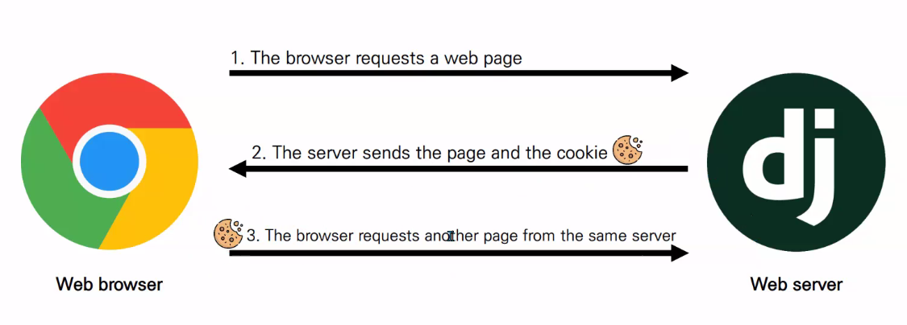
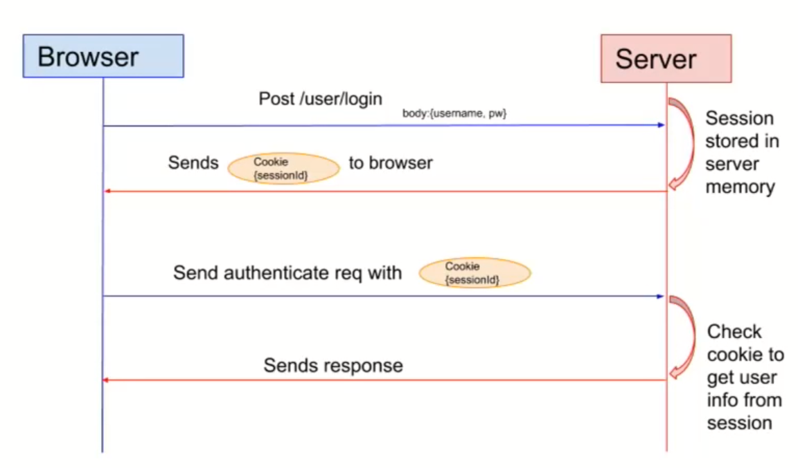

# 04. django_auth

> 2021.09.15

#### The Django Authentication System

* Django 인증 시스템은 django.contrib.auth에 Django contrib module로 제공
* 필수구성은 이미 포함 `settings.py - INSTALLED_APPS -`
  1. djagno.contrib.auth
     * 인증 프레임워크의 핵심과 기본 모델 포함
  2. django.contrib.contenttypes
     * 사용자가 생성한 모델과 권한을 연결할 수 있음
* Django 인증 시스템은 `인증(Authentication)` 과 `권한(Authorization)` 부여를 함께 제공


**Authentication(인증)**

- 신원 확인
- 자신이 누구라고 **주장하는 사람의 신원을 확인**하는 것


**Authorization(권한, 허가)**

- 권한 부여
- 가고 싶은 곳으로 가도록 혹은 **원하는 정보를 얻도록 허용**하는 과정


### HTTP 특징

> **H**yper **T**ext **T**ransfer **P**rotocol
>
> > HTML문서와 같은 리소스들을 가져올 수 있도록 해주는 프로토콜

* 비연결지향
  * 서버는 요청에 대한 응답을 보낸 후 연결을 끊음
* 무상태
  * 연결을 끊는 순간 클라이언트와 서버 간의 통신이 끝나며 상태 정보가 유지되지 않음
  * 클라이언트와 서버가 주고 받는 메시지들은 서로 완전히 독립적임
* 클라이언트와 서버의 지속적인 관계를 유지하기 위해 쿠키와 세션이 필요


## 쿠키

* 서버가 사용자의 웹 브라우저에 전송한은 작은 데이터 조각
* HTTP 쿠키는 상태가 있는 세션을 만들어줌
* 두 요청이 동일한 브라우저에서 들어왔는지 아닌지 판단할 때 주로 이용



#### 쿠키의 사용목적

1. 세션관리 
   * 로그인, 아이디 자동 완성, 공지 하루 안보기, 팝업체크, 장바구니 등의 정보 관리
2. 개인화
   * 사용자 선호, 테마 등의 설정
3. 트래킹
   * 사용자 행동을 기록 및 분석

#### 세션(Session)

* 사이트와 특정 브라우저 사이의 "상태(state)"를 유지시키는 것
* 클라이언트가 서버에 접속하면 서버가 특정 `session id`를 발급하고, 클라이언트는 발급 받은 session id를 쿠키에 저장
* ID는 세션을 구별하기 위해(일종의 열쇠) 필요하며, 쿠키에는 ID만 저장함 

#### 쿠키 lifetiome (수명)

1. Session cookies
   * 현재 세션이 종료되면 삭제됨
   * 브라우저가 '현재 세션'이 종료되는 시기를 정의
2. Persistent cookies (of Permanent cookies)
   * Expires 속성에 지정된 날짜 혹은 Max-Age 속성에 지정된 기간이 지나면 삭제

#### Session in Django

* Django의 세션은 미들웨어를 통해 구현됨
* database-backed sessions 저장 방식을 기본 값으로 사용
* 특정 session id를 포함하는 쿠키를 사용해서 각각 브라우저와 사이트가 연결된 세션을 알아냄
  * 세션 정보는 Django DB의 `django_session` 테이블에 저장됨
* 모든 것을 세션으로 처리하려고 하면 사용자가 많을 때 서버에 부하가 걸릴 수 있음



---

## Accounts

> app 이름이 반드시 accounts 일 필요는 없지만, **auth 관련 기본 설정들이 accounts로 내부적으로 사용되고** 있기 때문에 되도록 accounts로 명명한다.

```
$ python manage.py startapp accounts
```


------

## Sign Up

> **Django authentication system**
>
> https://docs.djangoproject.com/en/3.1/topics/auth/default/#module-django.contrib.auth.forms


### UserCreationForm

> https://github.com/django/django/blob/27c09043da52ca1f02605bf28600bfd5ace95ae4/django/contrib/auth/forms.py#L82


- `/accounts/signup/` 에 접속하면 UserCreationForm 을 통해 만들어진 form 의 모습을 확인 할 수 있다.

```python
# accounts/views.py

from django.shortcuts import render, redirect


def signup(request):
    if request.user.is_authenticated:
        return redirect('articles:index')
    if request.method == 'POST':
        form = UserCreationForm(request.POST)
        if form.is_valid():
            user = form.save()
            auth_login(request, user)
            return redirect('articles:index')            
    else:
        form = UserCreationForm()
    context = {
        'form' : form,
    }
    return render(request, 'accounts/signup.html', context)
```

- 회원가입을 해보고 admin 페이지에서 `사용자(들)` 에 새로운 계정이 생겼는지 확인


------


## Login

> **Session**을 **create** 하는 것과 같다

### AuthenticationForm

* buuilt-in forms


### `login()`

**login(request, user, backend=None)**

> https://docs.djangoproject.com/en/3.1/topics/auth/default/#authentication-in-web-requests

- 현재 세션에 연결하려는 인증 된 사용자가 있는 경우 `login()` 함수가 필요하다.

- django 의 session framework 를 통해 user 의 ID 를 세션에 저장한다.

- 즉, 로그인을 한다.

- `get_user()` : AuthenticationForm의 인스턴스 메서드. user_cache를 return

  ```python
  # accounts/urls.py
  
  path('login/', views.login, name='login'),
  ```

  > `AuthenticationForm` 은 왜 첫번째 인자가 request 인가? ModelForm이 아닌 일반 Form 이기 때문.

  ```python
  # accounts/views.py
  
  from django.shortcuts import render, redirect
  from django.contrib.auth import login as auth_login
  from django.contrib.auth.forms import UserCreationForm, AuthenticationForm
  
  
  def login(request):
      if request.user.is_authenticated:
          return redirect('articles:index')
  
      if request.method == 'POST':
          form = AuthenticationForm(request, request.POST)
          if form.is_valid():
              auth_login(request, form.get_user())
              return redirect('articles:index')
      else:
          form = AuthenticationForm()
      context = {
          'form' :form,
      }
      return render(request, 'accounts/login.html', context)
  ```
  
  - login 함수 이름을 `auth_login` 으로 변경해서 사용하는 이유는 view 함수인 login 과의 충돌을 방지하기 위함이다.
  
  - 로그인 후 브라우저와 DB에서 세션 확인

------

## Logout

> 로그아웃은 CRUD 패턴에서 **Session을 Delete** 하는 로직과 같다.

### logout()

> https://docs.djangoproject.com/ko/3.1/topics/auth/default/#how-to-log-a-user-out

- logout 함수는 HttpRequest 객체를 인자로 받고 return 값은 없다.

- logout 함수를 호출하면 현재 request에 대한 db의 session data를 완전히 정리하고, 클라이언트 쿠키에서도 sessionid가 삭제된다.

- 이는 다른 사람이 동일한 웹 브라우저를 사용하여 로그인하고, 이전 사용자의 세션 데이터에 액세스하는 것을 방지하기 위한 것이다.

- 사용자가 로그인하지 않은 경우 오류를 발생시키지 않는다.

  ```python
  # accounts/urls.py
  
  path('logout/', views.logout, name='logout'),
  ```

  ```python
  # accounts/views.py
  
  from django.contrib.auth import logout as auth_logout
  from django.views.decorators.http import require_POST
  
  
  @require_POST
  def logout(request):
      if request.user.is_authenticated:
          auth_logout(request)
      return redirect('articles:index')
  ```


------


## 로그인 사용자에 대한 접근 제한

> **미들웨어**
>
> - http 요청 / 응답 처리 중간에서 작동하는 시스템(hooks)
>- 장고는 http 요청이 들어오면 미들웨어를 거쳐서 해당 URL 에 등록되어 있는 뷰로 연결해주고, http 응답 역시 미들웨어를 거쳐서 내보낸다.
> - 데이터 관리, 애플리케이션 서비스, 메시징, 인증 및 API 관리는 주로 미들웨어를 통해 처리
> - 개발자들이 애플리케이션을 보다 효율적으로 구축할 수 있도록 지원하며 애플리케이션, 데이터 및 사용자 사이를 연결하는 요소처럼 작동

- django 는 세션과 미들웨어를 통해 인증 시스템(authentication system)을 request 객체에 연결한다.


### is_authenticated

> **주의!** 이것은 권한(permission)과는 관련이 없으며 사용자가 활성화 상태(active)이거나 유효한 세션(valid session)을 가지고 있는지도 확인하지 않음

> https://docs.djangoproject.com/en/3.1/ref/contrib/auth/#attributes
>
> https://github.com/django/django/blob/27c09043da52ca1f02605bf28600bfd5ace95ae4/django/contrib/auth/base_user.py#L90

- 사용자가 인증 되었는지 알 수 있는 방법

- User model 의 `속성(attributes)` 들 중 하나.

- User에 항상 `True`이며, AnonymousUser에 대해서만 항상 `False`이다.

- 일반적으로 request.user 에서 이 속성을 사용하여 미들웨어의 `'django.contrib.auth.middleware.AuthenticationMiddleware'`를 통과 했는지 확인한다.

  

**로그인 후에는 로그인/회원가입 페이지 접근 제한**

- 현재 로그인 상태에서도 주소창에 `accounts/signup/` 또는 `accounts/login/` 를 입력하면 접속이 가능하다.

- 로그인이 되어있는 상태라면 로그인과 회원가입 페이지에 접근할 수 없도록 해보자

  ```python
  # accounts/views.py
  
  def signup(request):
      if request.user.is_authenticated:
          return redirect('articles:index')
  
  def login(request):
      if request.user.is_authenticated:
          return redirect('articles:index')
  ```


### login_required decorator

> https://docs.djangoproject.com/en/3.1/topics/auth/default/#limiting-access-to-logged-in-users
>
> https://github.com/django/django/blob/27c09043da/django/contrib/auth/decorators.py#L38

- 로그인 하지 않은 사용자의 경우

  ```
settings.LOGIN_URL
  ```
  
  에 설정된 문자열 기반 절대 경로로 리다이렉트 된다.

  - ex) 이후 인증 성공시 사용자가 redirect 되어야하는 경로는 `next`라는 쿼리 문자열 매개 변수에 저장

- LOGIN_URL 의 기본 값은 `'/accounts/login/'`, 우리가 두번째 app 이름을 accounts 로 했던 이유 중 하나

- 로그인 된 사용자의 경우 정상적으로 해당 view 를 실행한다.


**로그인 상태에서만 글을 작성/수정/삭제 할 수 있도록 변경**

- `@login_required` 는 해당 view 함수를 실행 하려면 로그인이 필요하다는 조건을 만들어준다.

  ```python
  # articles/views.py
  
  from django.contrib.auth.decorators import login_required
  
  
  @login_required
  @require_http_methods(['GET', 'POST'])
  def create(request):
  
    
  @login_required
  @require_http_methods(['GET', 'POST'])
  def update(request, pk):
  
    
  @login_required
  @require_POST
  def delete(request, pk):
  ```

  - 이제 `articles/create/` 로 강제 접속 시 로그인 페이지로 리다이렉트 된다.
  - 그런데 `/accounts/login/?next=/articles/create/` 와 같은 주소가 생성된다.

##### `"next"` query string parameter

- `@login_required` 은 기본적으로 인증 성공 후 사용자를 리다이렉트 할 경로를 **next 라는 문자열 매개 변수에 저장**한다.

  ```python
  # accounts/views.py
  
  def login(request):
      if request.user.is_authenticated:
          return redirect('articles:index')
  
      if request.method == 'POST':
          form = AuthenticationForm(request, request.POST)
          if form.is_valid():
              auth_login(request, form.get_user())
              return redirect(request.GET.get('next') or 'articles:index')
  ...
  ```

  > 주의
  >
  > 만약 `login.html`에서 form action이 작성되어 있다면 동작하지 않는다.
  >
  > ```django
  > 
  > <h1>로그인</h1>
  > <form action="" method="POST">
  >   
  >   {{ form.as_p }}
  >   <input type="submit">
  > </form>
  > 
  > ```
  >
  > - 해당 action 주소 자체가 next 파라미터가 붙어있는 현재 url이 아닌 `/accounts/login/` 으로 요청을 보내기 때문이다.


**두 데코레이터로 인해 로직상 문제 발생**

- 비로그인 상태로 detail 페이지에서 글 삭제 시도해보자.
- 만약 `@require_POST` 가 있는 함수에 `@login_required` 가 설정 된다면 로그인 이후 `"next"` 매개변수를 따라 해당 함수로 다시 redirect 되면서 `@require_POST` 때문에 405 에러가 발생하게 될 것이다.
- 이 경우 두가지 문제가 발생하게 되는데 첫째로는 **redirect 중 POST 데이터의 손실**이 일어나며 둘째로는 애초에 **redirect 는 POST Request 가 불가능**하여 GET Request 로 요청이 보내진다.
- 비로그인 상태 POST로 요청 -> 로그인 검증(@login_required) -> 로그인 페이지 (?next='articles/1/delete/') -> 로그인 성공 -> next로 redirect (GET Request) -> POST인지 검증(@require_POST) -> 405 Method Not Allowed

> `login_required` 는 GET 요청을 처리할 수 있는 View에서만 사용하자.

- 때문에 POST 요청만 허용하는 `delete` 와 같은 함수는 아래와 같이 함수 내부에서 처리하도록 한다.

  ```python
  # articles/views.py
  
  @require_POST
  def delete(request, pk):
      if request.user.is_authenticated:
          article = Article.objects.get(pk=pk)
          article.delete()
      return redirect('articles:index')
  ```


------


## 회원 탈퇴

- 탈퇴하는 것은 DB 에서 유저를 삭제하는 것과 같다.

- 로그인 된 상태에서만 회원 탈퇴 링크를 만들어서 회원 정보를 삭제하도록 한다.

  ```
  # accounts/urls.py
  
  path('delete/', views.delete, name='delete'),
  ```

  ```python
  # accounts/views.py
  
  from django.views.decorators.http import require_POST
  
  @require_POST
  def delete(request):
      if request.user.is_authenticated:
          request.user.delete()
          auth_logout(request)
      return redirect('articles:index')
  ```

  - sqlite 확장프로그램이나 admin 페이지에서 유저가 삭제 되었는지 확인해 본다.


------


## 회원 수정

### UserChangeForm

> https://docs.djangoproject.com/en/3.1/topics/auth/default/#django.contrib.auth.forms.UserChangeForm
>
> https://github.com/django/django/blob/27c09043da52ca1f02605bf28600bfd5ace95ae4/django/contrib/auth/forms.py#L142

- 회원 정보를 수정하는 ModelForm은 `UserChangeForm` 을 사용한다.

  ```
  # accounts/urls.py
  
  path('update/', views.update, name='update'),
  ```

  ```python
  # accounts/views.py
  from django.contrib.auth.forms import UserCreationForm, AuthenticationForm, UserChangeForm
  
  
  def update(request):
      if request.method == 'POST':
          pass
      else:
          form = UserChangeForm(instance=request.user)
      context = {
          'form': form,
      }
      return render(request, 'accounts/update.html', context)
  ```

  

### Custom Form

- 위와 같이 했을 때의 문제점은, 일반 사용자가 접근해서는 안될 정보들(fields)까지 모두 수정이 가능해진다.

- 그래서 `UserChangeForm` 을 상속받아 새로운 `CustomUserChangeForm` 을 만들어 접근 가능한 필드를 조정해야 한다.

  ```python
  # accounts/forms.py
  
  from django.contrib.auth.forms import UserChangeForm
  from django.contrib.auth import get_user_model
  
  class CustomUserChangeForm(UserChangeForm):
  
      class Meta:
          model = get_user_model()
          fields = ('email', 'first_name', 'last_name',)
  ```

1. `get_user_model()` 은 무엇일까?
2. User의 fields 명들은 어떻게 알 수 있을까?


### `get_user_model()`

- `User` 를 직접 참조하는 대신`django.contrib.auth.get_user_model()` 을 사용하여 User model 을 참조해야 한다.
- **이 함수는 현재 활성화(active)된 user model을 리턴**한다.

**AbstractUser**

> User model을 구현하는 완전한 기능을 갖춘 기본 클래스

```python
# accounts/views.py

@require_http_methods(['GET', 'POST'])
@login_required
def update(request):
    if request.method == 'POST':
        form = CustomUserChangeForm(request.POST, instance=request.user)
        if form.is_valid():
            form.save()
            return redirect(request.GET.get('next') or 'articles:index')
    else:
        form = CustomUserChangeForm(instance=request.user)
    context = {
        'form':form
    }
    return render(request, 'accounts/update.html', context)
```

- admin 페이지에서 실제 회원정보가 수정되었는지 확인해보자.

- 로그인 한 유저만 해당 view 를 호출할 수 있도록 한다.


------


## 비밀번호 변경

### PasswordChangeForm

- 회원정보 수정을 위한 `UserChangeForm` 에도 password 필드는 있지만 막상 필드를 보면 수정할 수 없다.

- 대신, 가장 하단에 '**다만 이 양식으로 비밀번호를 변경할 수 없습니다.**' 라는 문구가 있는데, 이 링크를 클릭하면 `accounts/password/` 라는 주소로 이동한다. django가 기본적으로 설정하고 있는 주소이다.

  ```python
  # accounts/urls.py
  
  path('password/', views.chg_pw, name='chg_pw'),
  ```

  ```python
  # accounts/views.py
  
  from django.contrib.auth.forms import (
      UserCreationForm,
      AuthenticationForm,
      PasswordChangeForm,
  )
  
  
  @login_required
  def chg_pw(request):
      if request.method == 'POST':
          form = PasswordChangeForm(request.user, data=request.POST)
          if form.is_valid():
              form.save()
              return redirect('articles:index')
      else:
          form = PasswordChangeForm(request.user)
      context = {'form': form}
      return render(request, 'accounts/chg_pw.html', context)
  ```


- 비밀번호를 변경하고 나니 로그인이 풀려 버렸다.
- 변경된 비밀번호로 로그인 해보니 변경은 잘 되었다는 것을 확인할 수 있다.
- 그런데 로그아웃이 되어버린 이유는 비밀번호가 변경 되면서 기존 세션과의 회원 인증 정보가 일치하지 않게 되어 버렸기 때문이다.
- 이 문제를 막기 위해서 `update_session_auth_hash` 를 사용한다.


### `update_session_auth_hash()`

> 암호 변경 시 세션 무효화 방지 이 함수는 **현재 요청**과 새 세션 해시가 파생 될 **업데이트 된 사용자 객체**를 가져 와서 세션 해시를 적절하게 업데이트 해준다.
>
> 즉, 현재 사용자의 **인증 세션이 무효화 되는 것을 막고**, **세션을 유지한 상태로 업데이트** 한다.

```python
# accounts/views.py

from django.contrib.auth import update_session_auth_hash

@login_required
def chg_pw(request):
    if request.method == 'POST':
        form = PasswordChangeForm(request.user, request.POST)
        if form.is_valid():
            user = form.save()
            update_session_auth_hash(request, user)
            return redirect('articles:index')
    else:
        form = PasswordChangeForm(request.user)
    context = {'form': form}
    return render(request, 'accounts/chg_pw.html', context)
```


