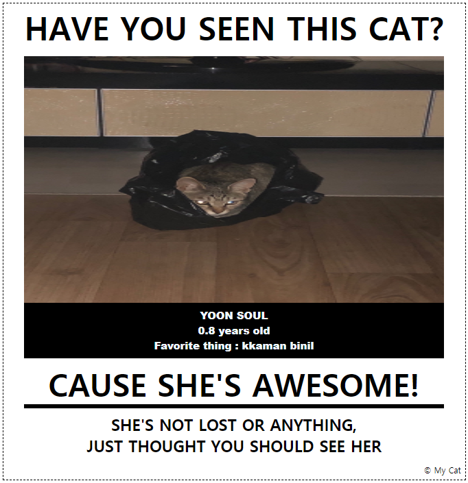
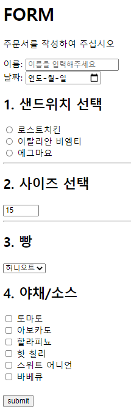

# <span style="color:red">:paw_prints: Practice HTML, CSS :paw_prints:</span>

## 1. *<HAVE YOU SEEN THIS CAT?>* 패러디 

> 
>
> [출처] 인터넷에 돌아다니는 유명 짤 (미상) 
>
> [내용] 고양이를 잃어버린 척하면서 은근슬쩍 자랑


#### 그래서. 

#### 우리집 고양이.

#### ~~나도 자랑해보기!~~




> HTML 코드

```html
<!DOCTYPE html>
<html lang="en">
<head>
  <meta charset="UTF-8">
  <meta name="viewport" content="width=device-width, initial-scale=1.0">
  <link rel="stylesheet" href="card.css">
  <title>Layout</title>
</head>
<body>
  <div class="container">
    <div class="card">
      <div class="card-nav">
        <h2>HAVE YOU SEEN THIS CAT?</h2>
      </div>
      <div class="card-header">
        
        <div class="card-img-description">
          <h4>YOON SOUL</h4>
          <h4>0.8 years old</h4>
          <h4>Favorite thing : kkaman binil</h4>
        </div>
      </div>
      <div class="card-body">
        <div class="card-body-title">
          <h2>CAUSE SHE'S AWESOME!</h2>
          <p></p>
        </div>
        <hr />
        <div class="card-body-content">
          <h3>
            SHE'S NOT LOST OR ANYTHING, 
            <br>JUST THOUGHT YOU SHOULD SEE HER 
          </h3>
        </div>
      </div>
      <div class="card-footer">
        <div>&copy; My Cat</div>
      </div>
    </div>
  </div>
</body>
</html>
```


> CSS 코드

```css
* {
  box-sizing: border-box;
  margin: 0;
  padding: 0;
}

.container {
  width: 1200px;
  margin: 200px auto;
}

h4 {
  font-size: 20px;
  font-weight: 900;
  font-family: Arial;  
}

a {
  font-family: Arial;
}

.card {
  width: 900px;
  border: 2px dashed black;
  
}

.card-nav {
  color: black;
  text-align: center;
  font-size: 41px;
  font-weight: bold;
  padding: 5px 0;
}

.card-header {
  padding: 10px 40px;
  font-size: 0;
}

.card-img {
  height: 480px;
  width: 100%;
}

.card-img-description {
  background-color: black;
  color: aliceblue;
  text-align: center;
  padding: 10px;
  /* margin-bottom: 36px; */
}

.card-body {
  padding: 0 40px;
}

.card-body-title {
  /* position: relative; */
  text-align: center;
  font-size: 40px;
}

.card-body-content {
  margin: 10px 0;
  text-align: center;
  font-size: 26px;
}

.card-footer {
  text-align: end;
  color: black;
  padding: 7px;
}

hr {
  border: solid;
}
```

## 2. Subway 주문서



> 코드

```html
<!DOCTYPE html>
<html lang="en">
<head>
    <meta charset="UTF-8">
    <meta http-equiv="X-UA-Compatible" content="IE=edge">
    <meta name="viewport" content="width=device-width, initial-scale=1.0">
    <title>Document</title>
</head>
<body>
    <h1>FORM</h1>
    <p>주문서를 작성하여 주십시오</p>
    <form action="#">
        <label for="name">이름:</label>
          <input type="text" id="name" name="name" placeholder="이름을 입력해주세요">
        <br>
        <label for="date">날짜:</label>
          <input type="date" id="date">
    <br>    
    <h2>1. 샌드위치 선택</h2>
        <input type="radio" name="sandwich" id="sandwich-1" value="1">
        <label for="sandwich-1">로스트치킨</label><br>
        <input type="radio" name="sandwich" id="sandwich-2" value="2">
        <label for="sandwich-2">이탈리안 비엠티</label><br>
        <input type="radio" name="sandwich" id="sandwich-3" value="3">
        <label for="sandwich-3">에그마요</label><br>
        <hr>
    <h2>2. 사이즈 선택</h2>
        <input type="number" name="size" id="size" min="15" max="30" step="15" value="15">
        <hr>
        <h2>3. 빵</h2>
        <select name="bread" id="">
            <option value="1">허니오트</option>
            <option value="2">위트</option>
            <option value="3">화이트</option>
            <option value="4">플랫</option>
            <option value="5">오트밀</option>
        </select>
        <br>
    <h2>4. 야채/소스</h2>
        <input type="checkbox" name="source" id="source-1" value="1">
        <label for="source-1">토마토</label><br>
        <input type="checkbox" name="source" id="source-2" value="2">
        <label for="source-2">아보카도</label><br>
        <input type="checkbox" name="source" id="source-3" value="3">
        <label for="source-3">할라피뇨</label><br>
        <input type="checkbox" name="source" id="source-4" value="4">
        <label for="source-4">핫 칠리</label><br>
        <input type="checkbox" name="source" id="source-5" value="5">
        <label for="source-5">스위트 어니언</label><br>
        <input type="checkbox" name="source" id="source-6" value="6">
        <label for="source-6">바베큐</label><br>
        <br>
        <input type="submit" value="submit">        
    </form>
</body>
</html>
```

