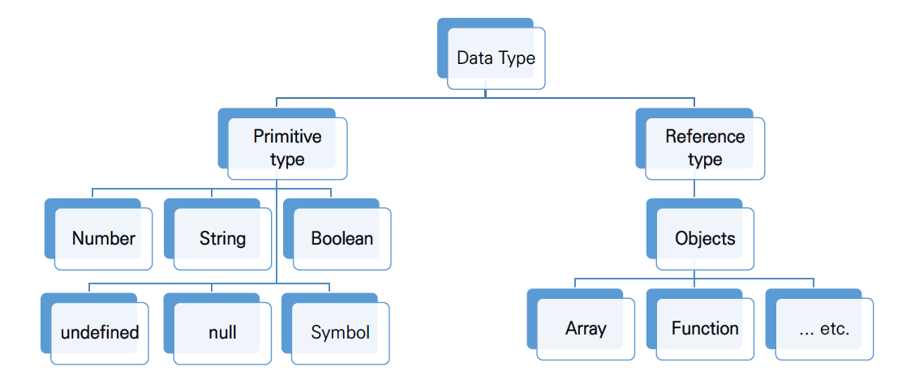

# 02. ECMAScript_6

> 2021.10.28

------

## 식별자 (identifier)

- 변수명은 식별자라고도 불림
- 규칙
  1. 반드시 문자, 달라($) 또는 밑줄로 시작해야 함 (숫자는, `-`로 시작할 수 없다)
  2. 대소문자를 구분한다.
  3. 예약어는 사용할 수 없다. (const, function, class, ....)
- 스타일
  - 카멜케이스(lowelCamelCase)
    - 객체, 변수, 함수
  - 파스칼케이스(UpperCamelCase)
    - 클래스, 생성자
  - 대문자 스네이크 케이스(UPPER_CASE)
    - 상수: 변수의 속성이 변하지 않는 것

| const         | let           | var         |
| ------------- | ------------- | ----------- |
| 재할당 불가능 | 재할당 가능   | 재할당 가능 |
| 재선언 불가능 | 재선언 불가능 | 재선언 가능 |
| 블록 스코프   | 블록 스코프   | 함수 스코프 |

### Hoisting

- var 로 선언된 변수는 선언 이전에 참조할 수 있는 현상

```javascript
console.log(hoisted)
var hoisted = 'can you see me?'
// undefined
```


---



## String

- JS에서 문자열을 표현하는 방법

  ```javascript
  st1 + str2 -> 자동 합쳐짐
  
  const num = 100
  const str6 = ` ${num} - ${str1}`
  ```
  
  - 리터럴
    - 리터럴이라는 단어는 값을 프로그램 안에서 직접 지정한다 라는 의미
    - 리터럴은 값을 만드는 방법

------

## Switch

```javascript
const name = 'admin'

switch(name) {
    case 'admin': {
        console.log('관리자 모드')
        break
    }
    case 'manager': {
        console.log('매니저 모드')
        break
    }
    default: {
        console.log(`${name} 님 환영합니다.`)
    }
}
```

------

### for문

```javascript
for (let i = 0; i < 6; i++){
    console.log(i)
}

const numbers = [0, 1, 2, 3]
for (const number of numbers){
    console.log(number)
}

const obj = { a: 'a', b: 'b'}
for (const o of obj){
    console.log(o)
    console.log(obj[o])
} // 에러 발생 Uncaught TypeError: obj in not iterable

const obj = { a: 'apple', b: 'banana'}
for (const o in obj){
    console.log(o)
    console.log(obj[o])
}
```

| 키워드    | 종류   | 연관 키워드           | 스코프      |
| --------- | ------ | --------------------- | ----------- |
| if        | 조건문 | -                     | 블록 스코프 |
| switch    | 조건문 | case, break, default  | 블록 스코프 |
| while     | 반복문 | break, continue       | 블록 스코프 |
| for       | 반복문 | break, continue       | 블록 스코프 |
| for... in | 반복문 | 객체(오브젝트) 순회   | 블록 스코프 |
| for... of | 반복문 | 배열 등 Iterable 순회 | 블록 스코프 |


------

## Function

```javascript
// 함수 선언식 
function isValid(password) {
	if (password.length < 8) {
		return false
	} else {
		return true
	}
}

isValid('abcd')

// 함수 표현식
const join = function (array, separator) {
	let phone_number = ''
	let len = array.length
	for (const num of array){
		phone_number += num
		len -= 1
		if (len > 0) {
			phone_number += separator
		}
	}
	return phone_number 
}

join(['010', '1234', '5678'], '-')

// 함수 기본인자
const makeOrder = function (menu, size = 'reqular') {
	let result = {
		menu: menu, // menu로만 생략 가능
		size: size // size
	}
	return result
}

makeOrder('mocha')
```

## 화살표 함수

```javascript
function celsiusToFahrenheit (celsius) {
	const fahrenheit = celsius * 9/5 + 32
	return fahrenheit
}
// 1. function 키워드 삭제, 화살표 추가
const celsiusToFahrenheit = (celsius) => {
	const fahrenheit = celsius * 9/5 + 32
	return fahrenheit
}
// 2. 매개변수가 하나일 경우 `()` 생략
const celsiusToFahrenheit = celsius => {
	const fahrenheit = celsius * 9/5 + 32
	return fahrenheit
}
// 3. 함수 바디가 하나의 표현식일 경우 `{ }` & return 생략
const celsiusToFahrenheit = celsius => celsius * 9/5 + 32
```

------

## fuction 키워드 호이스팅

```javascript
// 선언식일 때는 동작
add(2, 7)
function add (a, b) {
    return a + b
}

// 표현식일 때는? -> 에러 발생
sub(7, 2)
const sub = function (num1, num2) {
    return num1 - num2
}

// const sun = (num1, num2) => num1 - num2
```

------

## Arrays

#### 기본 배열 조작

| 메서드          | 설명                                                 | 비고                     |
| --------------- | ---------------------------------------------------- | ------------------------ |
| reverse         | **원본 배열**의 요소들의 순서를 반대로 정렬          |                          |
| push & pop      | 배열의 **가장 뒤에** 요소를 **추가 또는 제거**       |                          |
| unshift & shift | 배열의 **가장 앞에** 요소를 **추가 또는 제거**       |                          |
| includes        | 배열에 특정 값이 존재하는지 판별 후 **참/거짓 반환** |                          |
| indexOf         | 배열에 특정 값이 존재하는지 판별 후 **인덱스 반환**  | 요소가 없을 경우 -1 반환 |
| join            | 배열의 **모든 요소를 구분자를 이용하여 연결**        | 구분자 생략 시 쉼표 기준 |

#### 심화 (Array Helper Methods)

| 메서드  | 설명                                                         | 비고         |
| ------- | ------------------------------------------------------------ | ------------ |
| forEach | 배열의 각 요소에 대해 콜백 함수를 한 번씩 실행               | 반환 값 없음 |
| map     | **콜백 함수의 반환 값**을 요소로 하는 **새로운 배열 반환**   |              |
| filter  | **콜백 함수의 반환 값이 참인 요소들만** 모아서 **새로운 배열을 반환** |              |
| reduce  | **콜백 함수의 반환 값들을 하나의 값(acc)에 누적 후 반환**    |              |
| find    | 콜백 함수의 **반환 값이 참이면 해당 요소를 반환**            |              |
| some    | 배열의 **요소 중 하나라도 판별 함수를 통과**하면 참을 반환   |              |
| every   | 배열의 **모든 요소가 판별 함수를 통과**하면 참을 반환        |              |


## JSON (JavaScript Object Notation)

JavaScript Object 형태를 가지는 `문자열`

***object -> JSON(string)***

```
const objData = {
    coffee: 'Americano',
    icecream: 'Bravo corn',
}

const jsonData = JSON.stringify(objData)
console.log(typeof(jsonData))
```

***JSON -> object***

```
const objData2 = JSON.parse(jsonData)
console.log(typeof(objData2))
```

------

## 