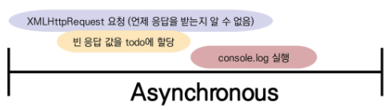
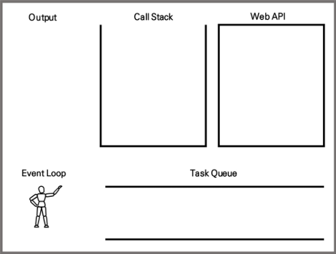

# 03_Ajax

> 2021.11.01

# AJAX

> **A**synchronous **J**avascript **A**nd **X**ML

*서버와 통신하기 위해 XMLHttpRequest 객체를 사용하는 것*

1. Google map, Google Search, Gmail 등에 사용된 기술을 설명하기 위해 등장한 개념

   - 구글 지도, 검색 등에서 스크롤을 하거나 입력하는 모든 행위는 '요청'이다.
   - 새로운 기술이 아닌 기존에 존재하던 기술을 설명하기 위한 용어
   
2. 특징

   - reload하지 않고 요청 작업을 비동기적으로 수행할 수 있다. (사용자 경험 향상)
   - 페이지의 전체가 아닌 일부만을 업데이트 할 수 있다.
   - HTML, JSON, XML, 그리고 일반 텍스트 등을 교환할 수 있다.

# XHR

> **X**ML**H**ttp**R**equest

*브라우저 내장 객체*

1. 서버와 상호작용하기 위해서 사용한다. 전체 페이지의 새로 고침없이 데이터를 받아올 수 있다.
2. 사용자가 하는 것을 방해하지 않고(== 새로고침이 발생하지 않는다.) 페이지의 일부를 업데이트 할 수 있다.
3. 주로 AJAX 프로그래밍에 사용한다.

---

1. Asynchronous

   > "기다려주지 않는다."

   ```javascript
   // JavaScript
   
   const xhr = new XMLHttpRequest()
   const URL = 'https://jsonplaceholder.typicode.com/todos/1'
   
   xhr.open('GET', URL)
   xhr.send()
   
   const todo = request.response
   
   console.log('data: ${todo}') // ''
   ```
   
   * 동기식
   
   * 비동기식
     * 요청을 보낸 후 응답을 기다리지 않고 다음 동작이 이루어짐
   
   
   
2. Single Thread

   > "혼자 일하기 때문에 기다릴 수가 없다."

   * 컴퓨터가 여러 개의 CPU를 가지고 있어도 main thread라 불리는 단일 스레드에서만 작업 수행

3. Event Loop

   > "JavaScript가 혼자서 일하는 방법"

   동시성 모델
   
   - Call Stack 
     - 함수의 호출을 기록하는 Stack 자료 구조
     - 한 번에 하나의 작업만 처리할 수 있으며 함수의 처리는 Stack이 다시 비워질 때까지 계속 이어진다.
   - Web API(Browser API) *다른 곳*
     - 브라우저에서 제공하는 API
     - `setTimeout`, `DOM events`, `XHR`
   - Task Queue *대기실*
     - Callback Function이 대기하는 Queue 자료 구조
   - Event Loop *담당자*
     - Call Stack이 비어있으면 Task Queue의 함수를 Call Stack으로 보낸다.
   
   

---

### Callback Function

*"다른 함수의 인자로 전달되는 함수"*

일급 객체(First-Class Citizen)

> "다른 객체들에 적용할 수 있는 연산을 모두 지원하는 객체(함수)"

일급 객체의 조건

1. 인자로 넘길 수 있어야 함
2. 함수의 반환 값으로 사용할 수 있어야 함
3. 변수에 할당할 수 있어야 함

비동기 처리의 과정은 요청한 결과가 처리되는 '**특정 시점**'에 '**어떠한 일(콜백 함수)**'을 이어나는 형태로 이루어진다.

-> 어떠한 일의 결과가 다른 일의 trigger가 되는 과정이 연속적으로 발생하면 콜백 함수의 콜백 함수를 넣는 과정이 반복되고 이는 Callback Hell(콜백 지옥)로 이어진다. 해결방안은 다음과 같음

> 1. Keep your code shallow
> 2. Modularize
> 3. Handle every single error
> 4. **Promise callbacks**

#### Promise

*"비동기 작업이 맞이 할 미래의 결과(성공/실패)를 약속하는 객체"*

1. 콜백 지옥을 해결하기 위해 등장한 개념
2. 2가지의 약속이 이행되는 상황을 가정한다.
   - 성공
     - `.then(callback function)`
     - 성공하고 나면 무엇을 할 지
   - 실패
     - `.catch(callback function)`
     - 실패하면 에러를 어떻게 처리(잡을지) 할 지

#### Axios

*"**Promise based** HTTP client for the browser and node.js"*

1. Promise 기반의 비동기 요청을 할 수 있는 JavaScript 라이브러리

2. 원래는 'XHR'이라는 브라우저 내장 객체를 활용해 AJAX요청을 처리하는데, 이보다 편리한 AJAX요청이 가능하도록 도움을 줌

3. 사용법

   ```javascript
   axios.get('https://jsonplaceholder.typicode.com/todos/asdf')
   	// Promise의 성공/실패에 대한 약속 이후의 처리를 할 수 있다. 
     .then(function (response) {
       console.log(response)
       return response.data
     })
   	// 이전 .then 내부 콜백 return 값은 다음 .then 내부 콜백의 인자로 넘어온다.
     .then(function (data) {
       console.log(data)
       return data.title
     })
     .then(function (title) {
       console.log(title)
     })
     .catch(function (error) {
       console.log(error)
     })
     .finally(function() {
           console.log('이건 무조건 실행됩니다.')
     })
   ```

   순차적이고 연쇄적인 처리

##### [부록] async & await

* 기존 Promise 시스템 위에 구축된 Syntactic Sugar
* Promise 구조의 then chaining을 제거

비동기 방식으로 처리하는 로직을 마치 동기적으로 표현 (코드 상으로)

#### 실습

```html
<body>
  <button>댕댕이</button>
  <div class='dog-box'>

  </div>
  <script src="https://cdn.jsdelivr.net/npm/axios/dist/axios.min.js"></script>
  <script>
```

```javascript
    const URL = 'https://dog.ceo/api/breeds/image/random'
    const myButton = document.querySelector('button')

    // 버튼을 클릭하면, dog api로 요청을 보냄
    myButton.addEventListener('click', function ( ) {
      axios.get(URL)
        .then(response => {
          // console.log(response.data)
          return response.data
        })
        .then(response => {
          // console.log(response.message)
          const imgUrl = response.message
          // img 태그 생성
          const newImgTag = document.createElement('img')
          // img 태그의 scr 속성이 imgUrl 값 할당
          newImgTag.src = imgUrl
          // console.log(newImgTag)
          // div 태그의 자식 태그로 완성된 img 태그를 삽입
          const dogBox = document.querySelector('.dog-box')
          dogBox.appendChild(newImgTag)
        })
        .catch(error => {
          console.log(error)
        })
    })
```

```html
  </script>
```

