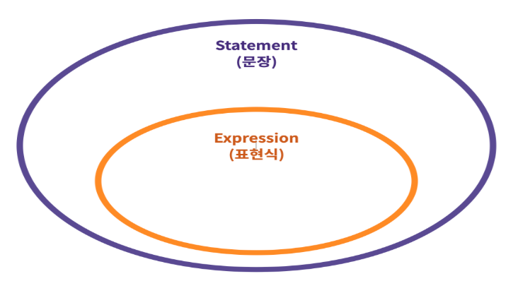
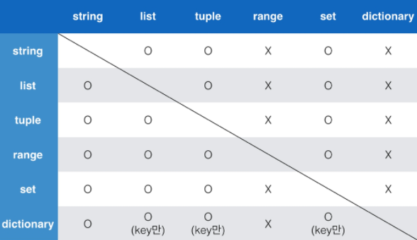
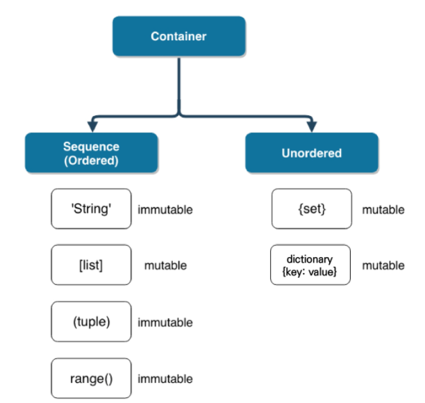

# Python 기초

> 인터프리터 언어 (Interpreter)
>
> 객체 지향 프로그래밍
>
> 동적 타이핑


:pushpin: ​코드 스타일 가이드를 반드시 지켜 작성한다. 
* [PEP 8] : <https://www.python.org/dev/peps/pep-0008/>
* [Google Python Style Guide] : <https://google.github.io/styleguide/pyguide.html>


## 변수

- 할당 연산자

  - 변수는 `=` 을 통해 할당(assignment) 된다.

  - 해당 데이터 타입을 확인하기 위해서는 `type()`을 활용

  - 해당 값의 메모리 주소를 확인하기 위해서는 `id()`를 활용

    ```python
    # 같은 값을 두 변수에 동시에 할당 가능
    x = y = 1
    
    # x, y swich
    a, b = 10, 20
    a, b = b, a
    ```

    

* 식별자(Identifiers)

  * 식별자에는 키워드 / 예약어를 사용할 수 없다.

  * 내장함수나 모듈 등의 이름으로도 만들면 안된다.

    ```python
    # 키워드 / 예약어 확인
    import keyword
    print(keyword.kwlist)
    ```

    

## 데이터 타입

### 1. 숫자(Number) 

* int (정수)

  * python 3.x에서 long은 없어짐

  * overflow가 발생하지 않음

    ```python
    # n진수 표현법
    binary_number = 0b10
    print(binary_number)
    
    octal_number = 0o10
    print(octal_number)
    
    hectal_number = 0x10
    print(hectal_number)
    ```

    ```python
    # 가장 큰 수가 유동적으로 변함
    import sys
    print(sys.maxsize*sys.maxsize)
    ```

    

* float (부동소수점, 실수)

  * Floating point rounding error 주의

    ```python
    3.14 - 3.02 == 0.12 # False
    round(3.5 - 3.2, 2) == 0.3 #True
    ```

    ```python
    # sys 모듈을 통해 처리하는 법 : 'epsilon'은 부동소수점 연산에서 반올림 함으로써 발생하는 오차 상환
    a, b = 3.5, 3.2
    import sys
    abs(a-b) <= sys.float_info.epsilon #True
    
    # math 모듈 활용
    import math
    math.isclose(3.14, 3.02) # True
    ```

* complex (복소수)

  * 파이썬에서 복소수는 허수부를 j로 표현

    ```python
    a = 3+4j
    ```

### 2. 문자열(String)

* 이스케이프 시퀀스 (escape sequence)

  | 예약문자 | 내용(의미)      |
  | -------- | --------------- |
  | \n       | 줄 바꿈         |
  | \t       | 탭              |
  | \r       | 캐리지리턴      |
  | \0       | 널 (Null)       |
  | \\\      | \               |
  | \\'      | 단일인용부호(') |
  | \\"      | 이중인용부호(") |
  
  

- String interpolation

  - %-formatting

    ```python
    print('내 이름은 %s 입니다.' % name)
    ```

  - str.format()

    ```python
    print('내이름은 {} 입니다.'.format(name))
    ```

  - f-string

    ```python
    print(f'내 이름은 {name} 입니다.')
    ```

  - f-string에서는 형식을 지정할 수 있음

    ```python
    # 다양한 형식을 활용하기 위해 datetime 모듈로 오늘을 표현
    import datetime
    now = datetime.datetime.now()
    print(now)
    
    # interpolation에서 출력형식을 지정할 수 있음\
    f'올해는 {now:%Y}년 이번달은 {now:%m}달 오늘은 {now:%d}일 입니다.'
    
    # string interpolation을 통해 출력형식 지정 뿐만 아니라, 연산도 가능
    pi = 3.141592
    r=10
    print(pi)
    print(f'{pi:.3} 넓이는 : {pi * r * r}')
    ```


### 3. 참/거짓(Boolean)

- 비교/논리 연산을 수행 등에서 활용

- False로 변환되는 예

  `0, 0.0, (), [], {}, '', None`

  

### 4. None

```python
bool(None) # False
print(type(None)) # <class 'NoneType'>
```


## 타입 변환

### 1. 암시적 타입 변환 (Implict Type Conversion)

- 사용자가 의도하지 않고, 파이썬 내부적으로 자동으로 타입 변환 하는 경우

  

### 2. 명시적 타입 변환 (Explicit Type Conversion)

* 사용자가 특정 함수를 활용해서 의도적으로 타입 변환을 하는 경우

  * `int()` : `string, float`를 `int`로 변환
  * `float()` : `string, int`를 `float`로 변환
  * `str()` : `int, float, list, tuple, dictionary`를 `string`로 변환

  ```python
  # string의 문자가 숫자일때만 형변환이 가능
  int('a') # Error
  # string 3.5를 int로 변환할 수는 없음
  int('3.5') # Error
  int(float('3.5')) # 3
  # float 3.5는 int로 변환이 가능
  int(3.5) # 3
  ```


## 연산자 (Operator)

### 1. 산술 연산자

| 연산자 | 내용           |
| ------ | -------------- |
| +      | 덧셈           |
| -      | 뺄셈           |
| *      | 곱셈           |
| /      | 나눗셈         |
| //     | 몫             |
| %      | 나머지(modulo) |
| **     | 거듭제곱       |


* 정수 나눗셈으로(소수부 없이) 정수 결과를 얻으려면 // 연산자를 사용

  ```python
  # divmod는 나눗셈과 관련된 함수
  a, b = divmod(5, 2) #(2, 1)
  ```

  

### 2. 비교 연산자

| 연산자 | 내용                   |
| ------ | ---------------------- |
| <      | 미만                   |
| <=     | 이하                   |
| >      | 초과                   |
| >=     | 이상                   |
| ==     | 같음                   |
| !=     | 같지않음               |
| is     | 객체 아이덴티티        |
| is not | 부정된 객체 아이덴티티 |


### 3. 논리 연산자

| 연산자  |              내용              |
| ------- | :----------------------------: |
| A and B |    A와 B 모두 True시, True     |
| A or B  |   A와 B 모두 False시, False    |
| Not     | True를 False로, False를 True로 |

- 단축평가

  - 첫 번째 값이 확실할 때, 두 번째 값은 확인하지 않고 첫번째 값 반환

    ```python
    print(5 and 4) # 4
    print(5 or 3) # 5
    print(0 and 5) # 0
    print(5 or 0) # 5
    ```

  - `and` 연산에서 첫번째 값이 False인 경우 무조건 False => 첫번째 값 반환

  - `or` 연산에서 첫번째 값이 True인 경우 무조건 True => 첫번째 값 반환


### 4. 복합 연산자

| 연산자  | 내용       |
| ------- | ---------- |
| a += b  | a = a + b  |
| a -= b  | a = a - b  |
| a*= b   | a = a * b  |
| a /= b  | a = a / b  |
| a %= b  | a = a % b  |
| a **= b | a = a ** b |


### 5. 기타 연산자

* Concatenation

  ```python
  # 문자열을 더하기
  'hello ' + 'world' #'hello world'
  # list 더하기
  [1, 2, 3] + [4, 5, 6] #[1, 2, 3, 4, 5, 6]
  ```

* Containment Test

  `in` 연산자를 통해 요소가 속해있는지 여부를 확인할 수 있음

* Identity

  `is` 연산자를 통해 동일한 것인지 확인할 수 있음

  ```python
  # 파이썬에서 -5부터 256까지 숫자의 id는 동일
  a = 3
  b = 3
  print(a is b) # True
  
  c = 257
  d = 257
  print(c is d) # False
  ```

* Indexing / Slicing

  `[]`를 통한 값을 접근하고, `[:]`을 통해 리스트를 슬라이싱할 수 있음

  

### 6. 연산자 우선순위

1. `()`을 통한 grouping
2. Slicing
3. Indexing
4. 제곱연산자 `**`
5. 단항연산자 `+`, `-`  (음수 / 양수 부호)
6. 산술연산자 `*`, `/`, `%`
7. 산술연산자 `+`, `-`
8. 비교연산자, `in`, `is`
9. `not`
10. `and`
11. `or`

### 9. 문장과 표현식의 관계




## 컨테이너(Container)

### 시퀀스(sequence)형 

: 순서가 있는(ordered) 데이터 **(순서가 있다 != 정렬되어있다)**

* 리스트 (list)

* 튜플 (tuple) 

  * 수정 불가능

  * 일반적으로 파이썬 내부에서 활용됨

* 레인지 (range)

* 문자형 (string)

* 바이너리 (binary)


### 비시퀀스(non-sequence)형

: 순서가 없는(unordered) 데이터

* 세트 (set)

  * 수학에서의 집합과 동일한 구조

  ```python
  # 차집합
  print(set_a - set_b)
  
  # 합집합
  print(set_a | set_b)
  
  # 교집합
  print(set_a & set_b)
  ```

  * 중복된 값 존재 X -> 중복값 제거 활용

* 딕셔너리 (dictionary)

  * key 는 변경 불가능한 데이터(immutable) 만 활용가능 

    * string, integer, float, boolean, tuple, range

  * value 는 모든 값으로 설정 가능

    

### 컨테이너 형변환



### 컨테이너 분류



* 변경 불가능한 데이터 (immutable) : 복사 시, 재할당
* 변경 가능한 데이터(mutable) : 복사 시, 동일한 객체의 주소를 참조하고 있어 원객체까지 변경됨
