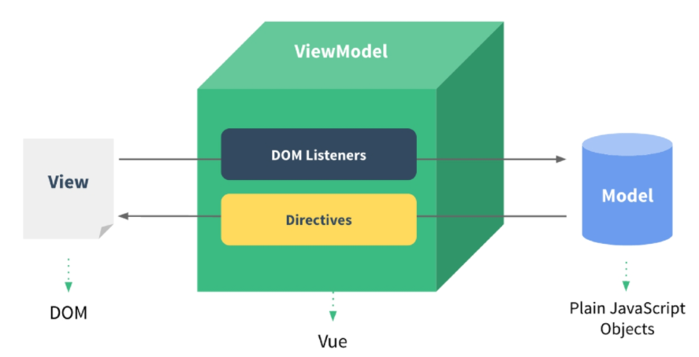

# 00_Vue.js intro

> 2021.11.03

**Front-End Development**

> "프론트 엔드 개발은 HTML, CSS, JavaScript를 활용해서 데이터를 눈으로 볼 수 있게 만들어 준다. 결과적으로 사용자는 데이터를 직접 눈으로 보며 데이터와 상호작용 할 수 있다."

Front-End Framework 3대장

- Vue.js
- React
- Angular

## CSR

> **C**lient **S**ide **R**endering

- Server에서 비어있는 HTML을 제공하면 Client에서 최종적인 내용물을 채워서 렌더링
  * -> 처음엔 뼈대만 받고 브라우저에서 동적으로 DOM을 그림
  * SPA가 사용하는 렌더링 방식
- Vue.js로 구현
- 장점
  1. 서버와 클라이언트 간 트래픽 감소
  2. 사용자 경험(UX) 향상
- 단점
  1. SSR에 비해 전체 페이지 렌더링 시점이 느림
  2. SEO(검색 엔진 최적화)에 어려움이 있음 (최초 문서에 데이터가 없기 때문)

## SSR

> **S**erver **S**ide **R**endering

- Server에서 완성된 결과물을 제공하면 Client는 그 결과물을 렌더링
- Django로 구현
- 장점
  1. 초기 구동 속도가 빠름
  2. SEO에 적합 (DOM에 이미 모든 데이터가 작성되어있기 떄문)
- 단점
  1. 모든 요청마다 새로운 페이지를 구성하여 전달 (사용자경험 떨어짐, 트래픽 부담 多)

## SPA

>  **S**ingle **P**age **A**pplication

- 단일 페이지 어플리케이션
- 서버로부터 최초로 응답 받은 HTML 문서 안에서 (거의) 모든 것을 한다.
  - 데이터를 가져오거나 가공하는 행위 나아가 동적인 조작까지 가능하다.
  - 모바일 앱과 비슷한 형태
- 연속되는 페이지 간의 사용자 경험을 향상
- Django를 사용해서 작성한 좋아요, 팔로우 로직은 응답 받은 페이지 내에서 AJAX 요청을 통해 페이지 갱신 없이 데이터를 조작하여 DOM을 변화 시켰기 때문에 SPA를 일부 활용했다고 할 수 있다.
- 동작의 원리 일부가 CSR의 구조를 따른다.

## Why Vue.js ?

**현대 웹의 특징**

- 한 페이지 내에 수많은 데이터가 존재한다.
  - 페이스북, 인스타그램
- 각 데이터의 변화 상황을 추적 & 관리하기 매우 까다로운 구조
- 순수한 JavaSript를 활용한 구현은 모든 데이터를 선택 & 변경하기 어렵고 규모가 큰 서비스의 경우 매우 큰 비용이 발생한다.

**Vue.js의 특징**

- Vue.js는 data의 변경 사항에 집중할 수 있도록 DOM은 data의 변화에 따라 알아서 re-rendering 하도록 구현
- DOM과 data가 연결되어 있기 때문에 data 자체에 집중하여 서비스를 개발할 수 있다.

## Concept of Vue.js ?

**MVVM**

- Model
  - JavaScript Object
  - Vue Instance 내부에 있으면 반응형이 된다.
- View
  - DOM(HTML)
  - Vue Instance에 의해 관리된다.
- ViewModel
  - ViewModel은 모든 Vue Instance이다.
  - Model과 View 사이의 중개자 역할을 한다.
  - ViewModel을 활용해 Data를 얼마만큼 잘 처리해서 보여줄 것인지(DOM)를 고민하는 것



## Quick Start of Vue.js

> "Data가 변화하면  DOM이 변경"

코드 작성 순서

1. Data 로직 작성
2. DOM 작성

##### 공식문서 Quick Start

> https://kr.vuejs.org/v2/guide/

Vetur & Chrome Dev Tools 설치

```vue
<!DOCTYPE html>
<html lang="ko">
<head>
  <meta charset="UTF-8">
  <meta name="viewport" content="width=device-width, initial-scale=1.0">
  <title>Vue Quick Start</title>
</head>
<body>
  <!-- 2. 선언적 렌더링 -->
  <h2>선언적 렌더링</h2>
  <div id="app">
    {{ message }}
  </div>
  <hr>

  <!-- 3. 엘리멘트 속성 바인딩 -->
  <h2>Element 속성 바인딩</h2>
  <div id="app-2">
    <span v-bind:title="message">
      내 위에 잠시 마우스를 올리면 동적으로 바인딩 된 title을 볼 수 있습니다!
    </span>
  </div>
  <hr>

  <!-- 4. 조건 -->
  <h2>조건</h2>
  <div id="app-3">
    <p v-if="seen">이제 나를 볼 수 있어요</p>
  </div>
  <hr>

  <!-- 5. 반복 -->
  <h2>반복</h2>
  <div id="app-4">
    <ol>
      <li v-for="todo in todos">
        {{ todo.text }}
      </li>
    </ol>
  </div>
  <hr>

  <!-- 6. 사용자 입력 핸들링 -->
  <h2>사용자 입력 핸들링</h2>
  <div id="app-5">
    <p>{{ message }}</p>
    <button v-on:click="reverseMessage">메시지 뒤집기</button>
  </div>
  <hr>

  <div id="app-6">
    <p>{{ message }}</p>
    <input v-model="message">
  </div>
  <hr>

  <!-- 1. Vue CDN -->
  <script src="https://cdn.jsdelivr.net/npm/vue/dist/vue.js"></script>
  <script>
    // 2. 선언적 렌더링
    var app = new Vue({
      el: '#app',
      data: {
        message: '안녕하세요 Vue!'
      }
    })

    // 3. 엘리먼트 속성 바인딩
    var app2 = new Vue({
      el: '#app-2',
      data: {
        message: '이 페이지는 ' + new Date() + ' 에 로드 되었습니다'
      }
    })

    // 4. 조건
    var app3 = new Vue({
      el: '#app-3',
      data: {
        seen: true // false로 토글 가능
      }
    })

    //5. 반복
    var app4 = new Vue({
      el: '#app-4',
      data: {
        todos: [
          { text: 'JavaScript 배우기' },
          { text: 'Vue 배우기' },
          { text: '무언가 멋진 것을 만들기' }
        ]
      }
    })

    //6. 사용자 입력 핸들링
    var app5 = new Vue({
      el: '#app-5',
      data: {
        message: '안녕하세요! Vue.js!'
      },
      methods: {
        reverseMessage: function () {
          this.message = this.message.split('').reverse().join('')
        }
      }
    })

    var app6 = new Vue({
      el: '#app-6',
      data: {
        message: '안녕하세요 Vue!'
      }
    })
  </script>
</body>
</html>
```

