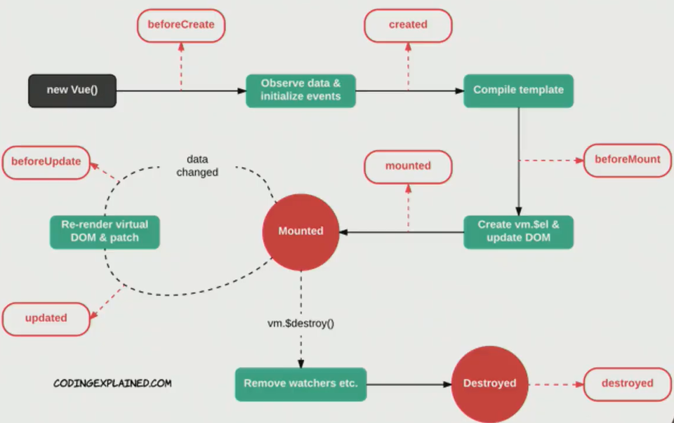

## Vue Life Cycle

* Vue 인스턴스가 생성될 때 사전에 정의된 몇 단계의 과정을 거쳐서 탄생하게 되는데 이를 Vue Life Cycle 이라고 부른다
* Vue Life Cycle 의 과정 중에서 직접 코드로 접근 가능한 부분이 있는데 이를 **라이프 사이클 훅**이라한다

* [공식 Document 링크](https://kr.vuejs.org/v2/guide/instance.html#인스턴스-라이프사이클-훅)

1. **생성이 되는 Creation 단계**

   - data와 이벤트가 추가되는 단계를 말함.

   - DOM은 아직 Vue Instance와 마운트(연결)가 되지 않았기 때문에 DOM 에 관련된 속성(`$el`)은 사용할수 없다.

   - Creation 단계에서 접근이 가능한 라이프 사이클 훅은 beforeCreate, created 가 있다. 주로 created 를 많이 사용한다.

     

   - **created**

     - data와 events 가 활성화되어서 접근할 수 있다.

     - 주로 API Server로 요청을 보내서 데이터를 받아올 때 사용한다.

       

2. **연결이 되는 Mounting 단계**

   - DOM과 Vue Instance의 마운트되는 단계를 말함.

   - 마운트 단계에서 사용할 수 있는 라이프 사이클 훅은 beforeMount, mounted 가 있다. 주로 사용하는건 mounted 이며 가장 많이 사용되는 라이프 훅 이다.

     

   - **mounted** 

     -  렌더링된 DOM에 접근할 수 있다.
     - DOM과 관련된 라이브러리(map API를 사용해서 DOM의 특정 영역에 지도 정보를 보여주고 싶은 경우) 사용할 수 있다.

     

3. **데이터가 바뀌는 Updating 단계**

   - 데이터의 변경으로 화면 렌더링이 다시 일어날 때의 단계

   - 업데이트 단계에서 접근가능한 라이프 사이클 훅은 beforeUpdate, updated가 있다. 주로 사용하는것은 updated 이다.

     

   - **updated**  

     - 재 렌더링이 완료된 후에 처리할 내용이 있을 때 
     - 이 단계에서 상태를 변경하게 되면 무한루프에 빠질 수 있다.

     

4. **Vue의 인스턴스가 삭제되는 Destruction 단계**

   - Vue instance 가 삭제되는 단계

   - 사용할 수 있는 라이프 훅은 beforeDestroy, destroyed 가 있다.

     

   - **destroyed** 

     - Vue Instance가 제거된 후 처리할 내용이 있을때 사용. 
     - 이 Hook에서는 모든 바인딩 해제된 상태