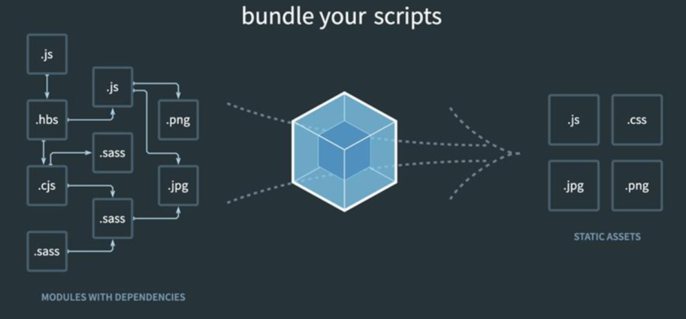
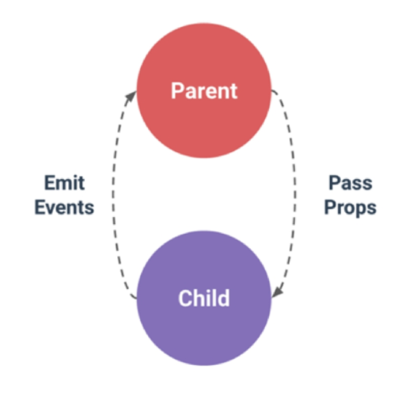

# 02. `vue_CLI` & vue_router

> 2021.11.08

##### Component (컴포넌트)

* 기본  HTML 엘리먼트를 확장하여 재사용 가능한 코드를 캡슐화 하는데 도움을 줌
* CS에서는 다시 사용할 수 있는 범용성을 위해 개발된 소프트웨어 구성 요소를 의미
* 유지보수 쉽게, 재사용성 강력

```
Vue 컴포넌트 === Vue 인스턴스
```

## SFC

> **S**ingle **F**ile **C**omponent

* Vue의 컴포넌트 기반 개발의 핵심 특징
* 하나의 컴포넌트 = `.vue` 확장자를 가진 하나의 파일 안에서 작성되는 코드의 결과물
* 화면의 특정 영역에 대한 HTML, CSS, FavaScript 코드를 하나의 파일에서 관리
* 즉 `.vue` 확장자를 가진 싱글 파일 컴포넌트를 통해 개발하는 방식 

```
Vue 컴포넌트 === Vue 인스턴스 = .vue 파일
```

# Vue CLI

* Vue.js 개발을 위한 표준 도구

## Node.js

* 단순히 브라우저만 조작할 수 있던 자바스크립트를 SSR 아키텍처에서도 사용할 수 있도록 함

### NPM

> **N**ode **P**ackage **M**anage

* Python: pip | Node.js: NPM
* 기본 패키지 관리자

```markdown
# 설치
$ npm install -g @vue/cli

# 버전 확인
$ vue --version

# 프로젝트 생성
$ vue create my-first-app
```

```markdown
# 프로젝트 디렉토리 이동
$ cd my-first-app

# 서버 실행
$ npm run serve
```

#### Vue 프로젝트 구조

> Babel

JavaScript compiler

* ECMAScript2015+ 코드를 구 버전으로 번역/변환해 주는 도구

> Webpack

static module bundler

* 모듈 간의 의존성 문제를 해결하기 위한 도구



# Pass Props & Emit Events

> "Props는 아래로, events는 위로"



##### 컴포넌트 등록 3단계

1. 불러오기
2. 등록하기
3. 보여주기

## Props

* props 옵션을 사용하여 부모의 데이터를 자식 컴포넌트로 전달함
* 자식 컴포넌트에서도 수신 할 props 데이터를 명시적으로 선언 후 사용

##### 단방향 데이터 흐름

* 모든 props는 하위 속성과 상위 속성 사이의 **단방향** 바인딩을 형성
* 자식 요소가 의도치 않게 부모 요소의 상태를 반경하여 앱의 데이터 흐름을 이해하기 어렵게 만드는 일을 방지
* 부모 컴포넌트 업데이트 -> 자식 컴포넌트의 props 업데이트

## Emit event

Listening to Child Components Events

`emit(eventName)`

* 추가 인자는 리스너의 콜백 함수로 전달