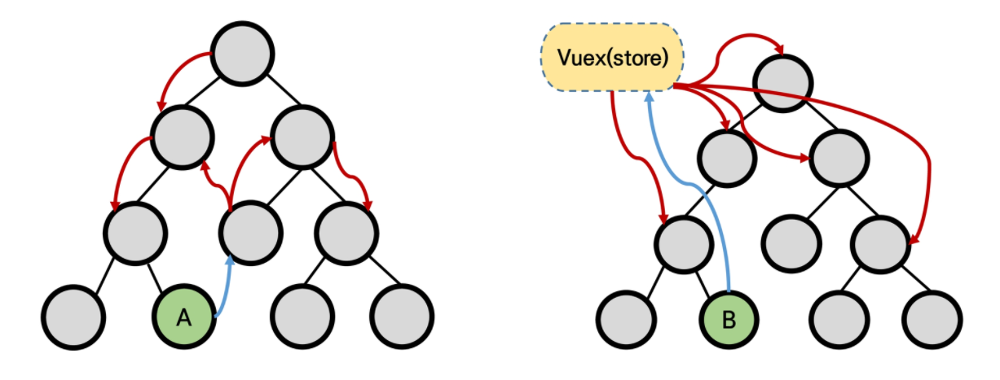
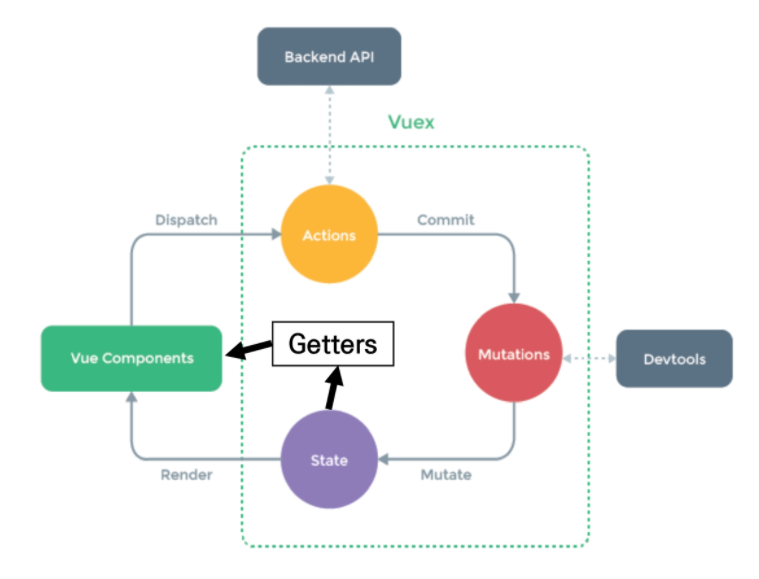

# 03. Vuex

> 2021.11.10

## Vuex

> "Statement management pattern + Library" for vue.js

* 상태 관리 패턴 + 라이브러리
* 애플리케이션의 모든 컴포넌트에 대한 중앙 집중식 저장소 역할 

### 중앙 집중식 저장소

규모가 커졌을 경우 상태 관리를 중앙(store)에서 하도록 한다. -> 상태 흐름 관리 매우 중요

- 상태의 변화는 모든 컴포넌트에 공유
- Store에 저장된 상태 정보가 업데이트되면 이를 공유하는 모든 컴포넌트는 알아서 이 변경 사항을 감지하고 반영한다.
- 더 이상 데이터를 컴포넌트 내부에서 관리해야 하는 불편함이 사라진다.

## Vuex Core Concept

> "Vuex는 무조건 도입하는 것이 아닌 필요한 순간에 적절한 판단을 통해 결정해야 한다."

1. `State`

   - `Mutations`에 정의된 메서드에 의해 변경
   - 중앙에서 관리하는 모든 상태 정보 즉, **data**를 의미한다.
   - '중앙 집중식 관리'라는 건 Vue.js로 만든 서비스에 내부에 존재하는 모든 상태를 '한 곳'에 모아서 관리하는 것을 의미한다.
   - 이전의 방식은 state를 찾기 위해 각 컴포넌트를 하나 하나 살펴봐야 했다면, Vuex를 활용하는 방식은 Store에서 관리하는 데이터에를 통해 state를 한 눈에 파악할 수 있다.
   -  state가 변화하면 해당 state 정보를 공유한 컴포넌트의 DOM은 Re-rendering된다.

2. `Mutations`

   * 실제로 state를 변경하는 유일한 방법

   - Actions에서 `commit`메서드에 의해 호출된다.
   - state를 변경하는 로직이 담기기 때문에 반드시 **동기적**인 코드만 작성한다.
     - 직관적으로 state가 어떻게 변경되는지 알 수 있다.
     - 이때 비동기적 로직이 수행되면 State가 변화하는 시점이 달라질 수 있기 때문에 관리가 불가능하다.

3. `Actions`

   - Vue Components에서 `dispatch`메서드에 의해 호출된다.

   - Backend API와 통신하여 data fetching 등의 작업을 수행한다.

     - 이 과정에서 동기적인 작업 뿐만 아니라 비동기적인 작업을 포함할 수 있다.
     - state를 변경하지 않는 건 비동기적인 작업 과정에서 state의 상태가 예상하는 것과 다를 수 있기 때문이다.

   - 항상 `context` 가 인자로 넘어온다.

     - 이름이 `context` 이유는 해당 객체는 모든 Vuex 요소에 접근할 수 있기 때문이다.
     - 즉, (우리가 작성 할 코드에서) `store.js` 파일 내에 있는 모든 요소에 접근해서 속성 접근 & 메서드 호출이 가능하다.

   - 단, (가능하지만) state를 직접 변경하지 않는다.

     - mutations에 정의된 메서드를 `commit` 메서드로 호출한다.
     - state는 오로지 mutations 메서드를 통해서만 조작한다.
     - 명확한 역할 분담을 통해 서비스 규모가 커져도 state를 올바르게 관리하기 위함이다.

4. `Vue Components`

   - Vuex Store에서 state 정보를 가져와 사용한다.
   - Dispatch를 사용해 Actions를 호출한다.

5. `Getters`

   - state를 변경하지 않고 활용하여 계산을 수행하는 로직이 들어간다. 첫 번째 인자로 state가 넘어온다.
   - Vue의 computed와 거의 동일하다.
     - 실제 계산된 값을 사용하는 것처럼 getters는 저장소의 상태(state)를 기준으로 계산한다.
       - 예를 들어, state에 todo list의 해야 할 일의 목록이 있다고 생각해보자. todo가 완료된 목록만 filtering해서 보여줘야 하는 경우 getters에서 `.filter` array helper를 사용해 `completed`의 값이 `true`인 요소가 필터링 해서 계산된 값을 담아 놓는다.
       - 혹은 우리가 활용한 예시처럼 모든 todos의 개수 및 필터링이 된 요소의 개수 등을 파악할 수 있다.
   - 여기서 핵심은 getters 자체가 state를 '변경'하는 것이 아니다.
     - 단순하게 state를 특정한 조건에 따라 구분(계산)한다.
     - 계산된 값을 '가져온다(get)' 정도로 이해

